## The Software Process

+ A structured set of activities required to develop a software system
+ Many different software processes but all involve
  + Specification
  + Design and implementation
  + Validation
  + Evolution
+ A software process model is an abstract representation of a process
  + It presents a description of a process from some particular perspective

There's typically an Architecture phase in between specification and design.

## Plan-Driven and Agile Processes

### Plan-Driven Processes

+ All activities are planned in advance
+ Progress is defined as progression along this plan

### Agile Processes

+ Planning is incremental
+ Easier to change to reflect the new desires of the customer

In practice, most practical processes involve some elements of both.

### Breakdown

Plan-Driven Approach | Agile Approach |
:- | :- |
Phased | Iterative and Incremental |
Working software is final phase | Working software every build |
Different people involved in different phases – context is lost | Same set of people – context is carried over |
Communication overhead and uses low quality communication channels | Less overhead and uses high quality communication channels |
Validation is done at final stage | Validation driven |
Predictive Planning | Adaptive Planning |
Development iterations tend to be few and long in between (months, quarters...) | Development iterations tend to be frequent and many (days or weeks) |
Changes follow formal process | Limited or no formal change control within iterations |
Changes accepted at certain stages | Changes embraced |

## A Generic Process Model

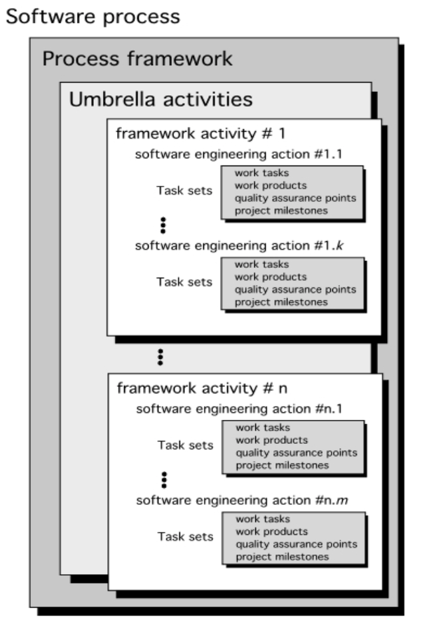{ width=50% }

## Software Process Flow

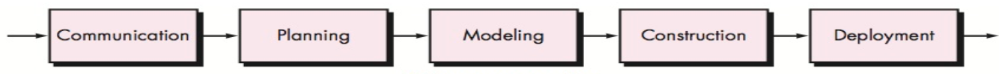{ width=100% }

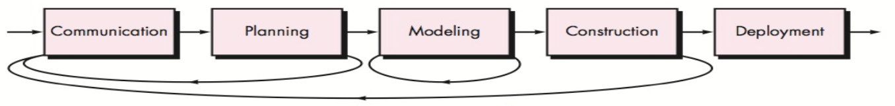{ width=100% }

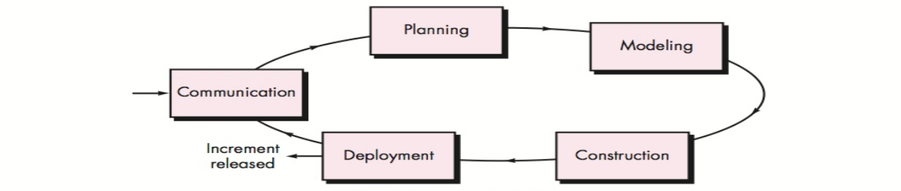{ width=100% }

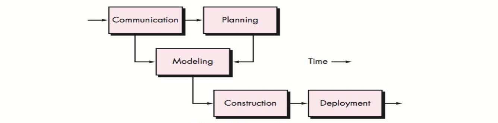{ width=100% }

## (A Few) Software Process Models

### Waterfall

+ Plan driven model
+ Separate and distinct phases of specification and development

### Incremental

+ Specification, development, and validation are interleaved
+ May be plan-driven or agile

### Reuse-Oriented

+ A system is assembled from existing components
+ May be plan-driven or agile

In practice, most large systems are developed using a process which incorporates elements from all of these models.

## The Waterfall Model

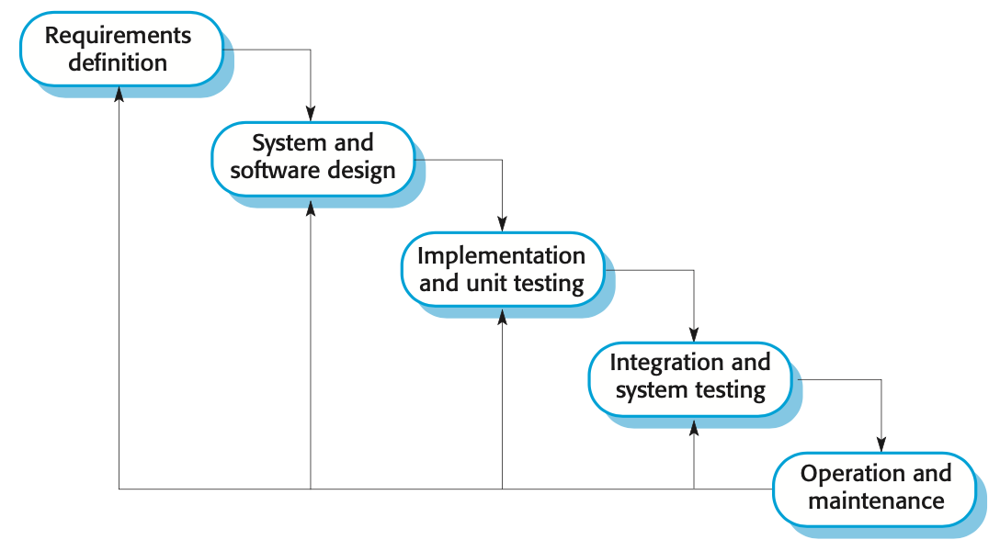{ width=75% }

### Shortcomings

+ Inflexible partitioning of the project into distinct stages makes it difficult to respond to changing customer requirements
+ Mostly used for large systems engineering projects where a system is developed at several sites and the development effort spans multiple years
+ A working version of the product isn't available until late in the lifespan

## The Incremental Model

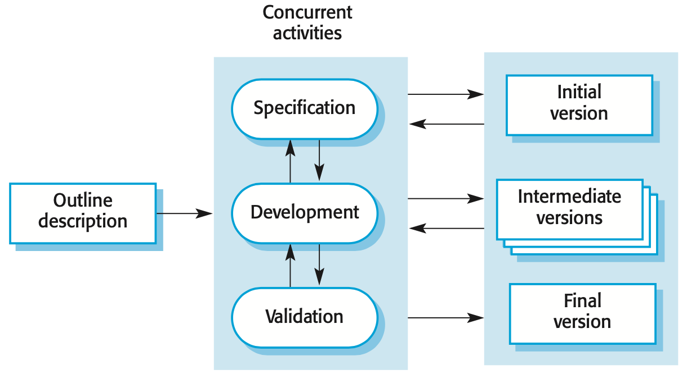{ width=75% }

### Advantages

+ The cost of accommodating changing customer requirements is reduced
+ It's easier to get customer feedback on the development work that has been done
+ More rapid delivery and deployment of useful software to the customer is possible

### Shortcomings

+ The process is not visible
+ System structure tends to degrade as new increments are added
+ Defining common features is hard
+ Contractual negotiations are required

## The Prototyping Model

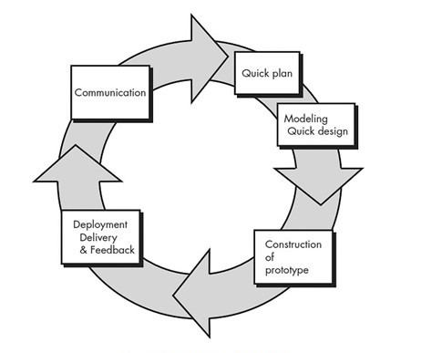{ width=75% }

### Advantages

+ Improved system usability
+ A closer match to users’ real needs
+ Improved design quality
+ Improved maintainability
+ Reduced development effort

### Shortcomings

+ Customer sees what appears to be a working version of the the software
+ Designer makes implementation compromises to get a quick prototype implementation
+ KEY: State up front -- building prototype and will be throwing throwing it away!

## The Spiral Model

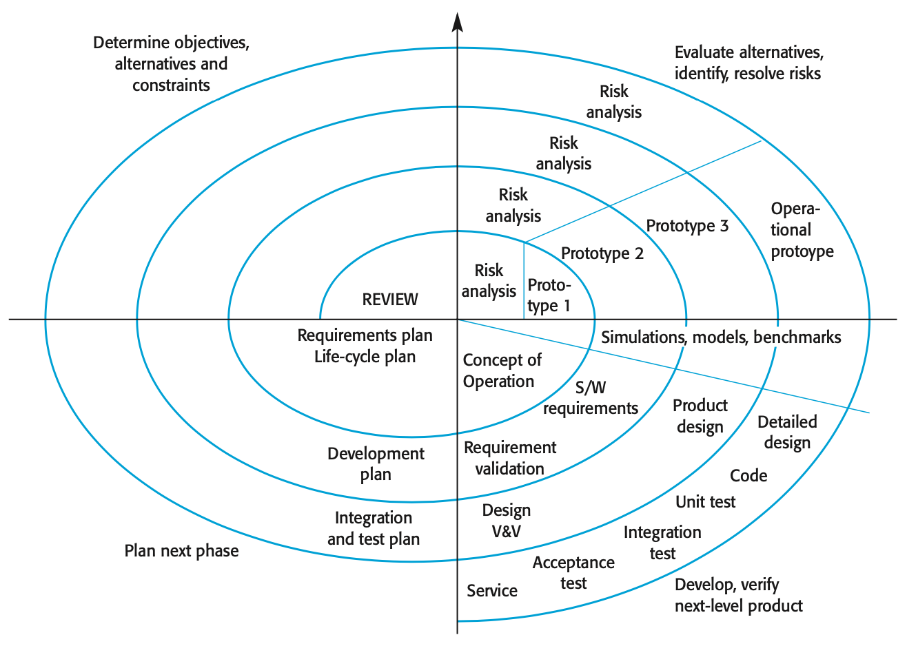{ width=100% }

+ Process is represented as a spiral instead of a sequence of activities with backtracking
+ Each loop in the spiral represents a phase in the process
+ No fixed phases such as specification or design
  + Loops in the spiral are chosen depending on what is required
+ Risks are *explicitly* assessed and resolved throughout the process

### Advantages

+ Makes risk management an explicit and big part of the development process

### Shortcomings

+ Difficult to convince customers that the process won't *spiral* out of control
+ Requires considerable risk management expertise

## Process Activities -- Software Specification

+ The process of establishing what services are required and the constraints on the system's operation and development
+ Requires engineering process
  + Feasibility study
  + Requirements elicitation and analysis
  + Requirements specification
  + Requirements validation

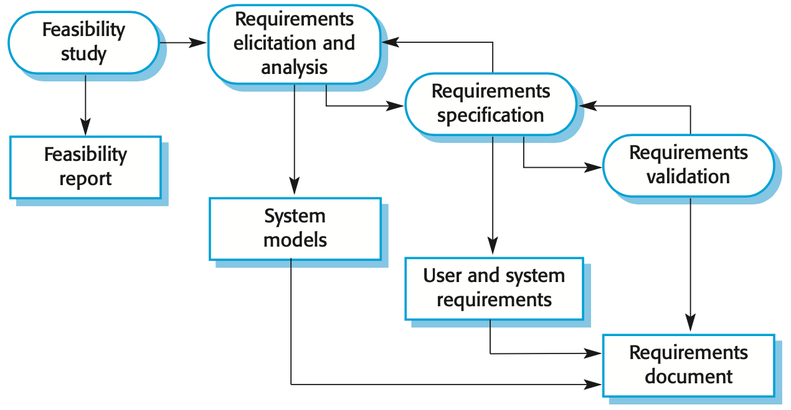{ width=75% }

## Software Design and Implementation

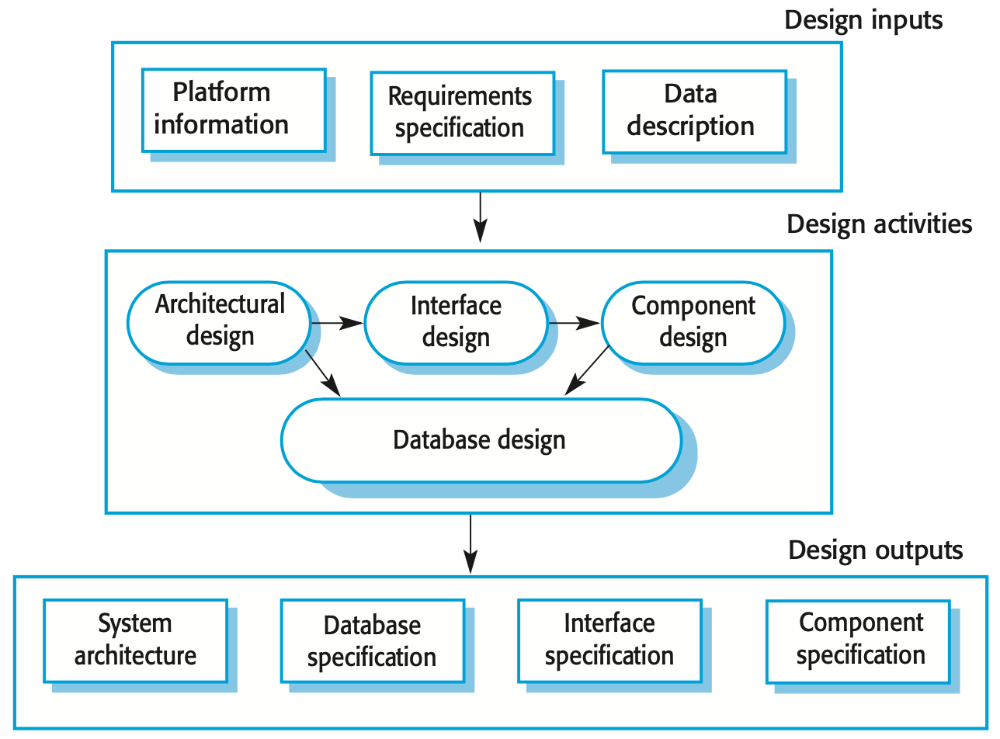{ width=75% }

+ The process of converting the system specification into an executable system
+ Software design
  + Design a software structure that realizes the specification
+ Implementation
  + Translate this structure into an executable program
+ The activities of design and implementation are closely related and may be interleaved

## Software Validation

+ Verification and validation (V&V)
  + Ensures system conforms to its specification
  + Ensures a system meets the requirements of the system customer
+ Involves checking and review processes and system testing
+ System testing

Testing is the most commonly used V&V activity.

## Testing Stages

+ Development or component testing
+ System testing
+ Acceptance testing

## Testing Phases: Plan-Driven Process

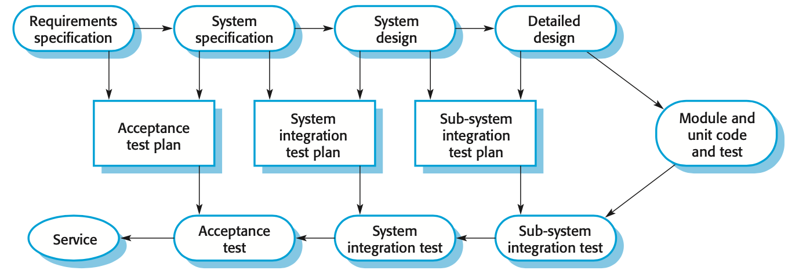{ width=100% }

## Software Evolution Process

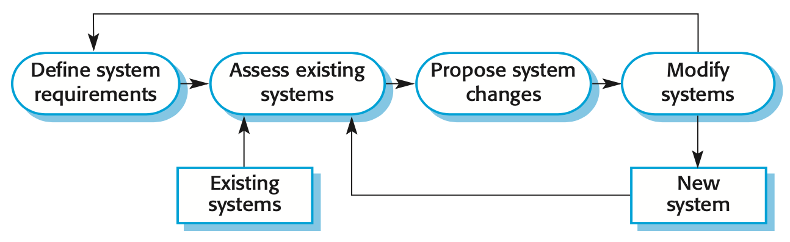{ width=75% }

+ As requirements change through changing business circumstances, the software that supports the business must also evolve and change
+ Although there has been a demarcation between development and evolution (maintenance) this is increasingly irrelevant as fewer and fewer systems are completely new

## Design Activities

+ Architectural design
+ Interface design
+ Component design
+ Database design
