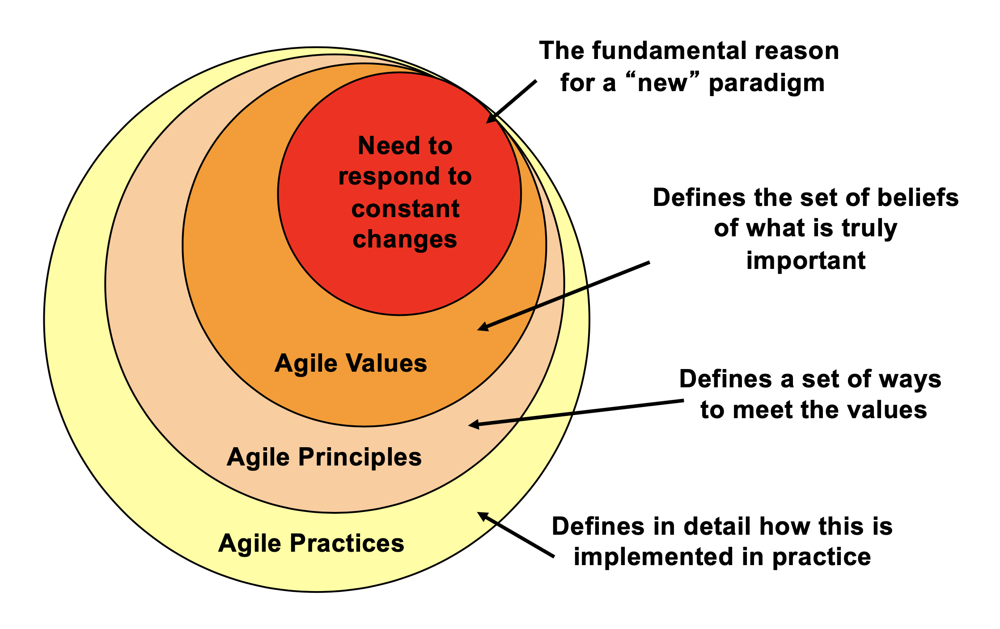
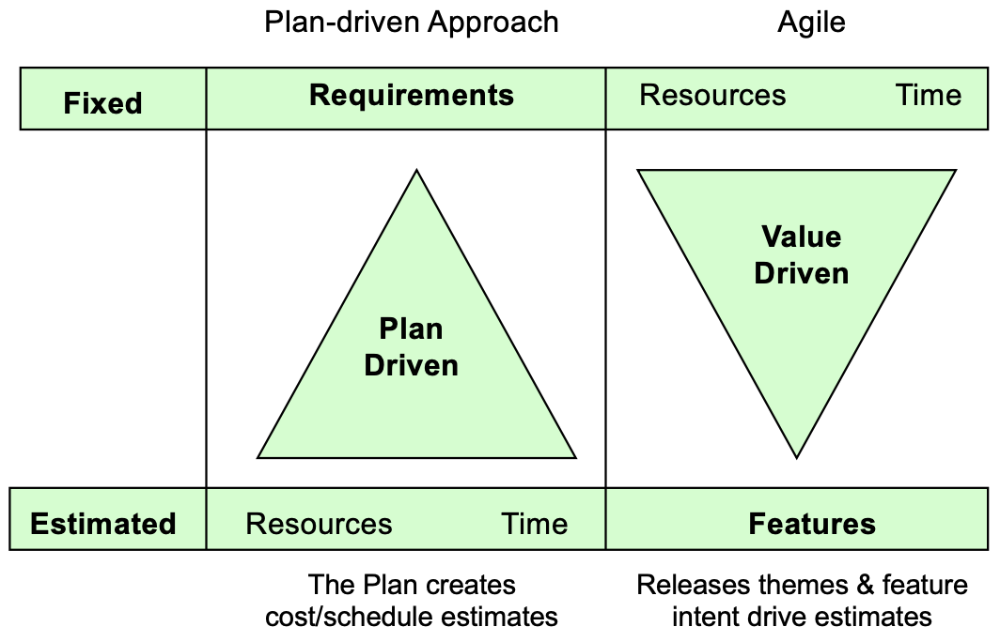
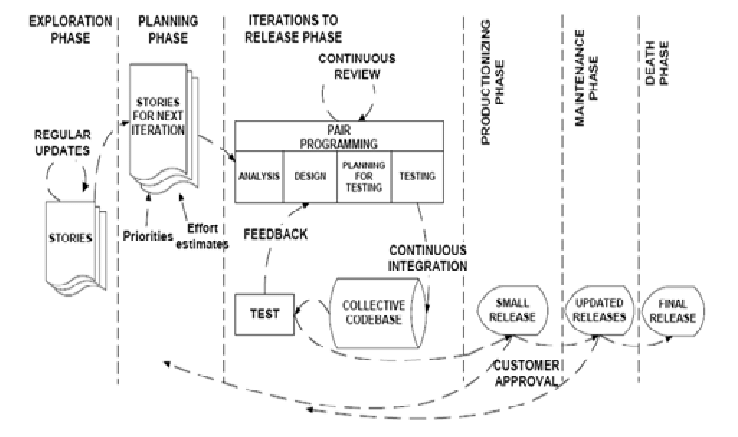
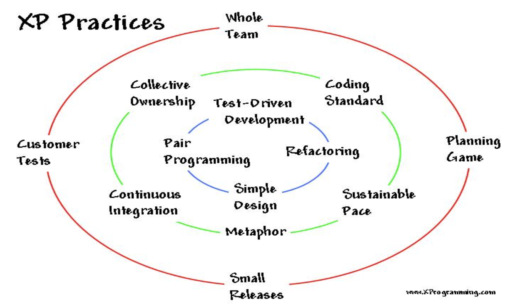

## Review of Previous Class

## Quick History

+ Software Crisis (1960's) Software intensive systems delivered late, over budget and without meeting the quality requirements that were set forward

Solution attempt #1: Structured Methods
Solution attempt #2: Object Oriented Methods

+ Chronic Software Crisis (1990's) Software intensive systems still delivered late, over budget and did not meet quality requirements

Solution attempt #1: Software Process Improvement
Solution attempt #2: Agile Methods

*TODO:* Add note about CMMI

## The Agile Manifesto

A collection of value statements.

> We are uncovering better ways of developing software by doing it and helping others do it. Through this work we have come to value:
>
> + Individuals and interactions over processes and tools
> + Working software over comprehensive documentation
> + Customer collaboration over contract negotiation
> + Responding to change over following a plan
> That is, while there is value in the items on the right, we value the items on the left more.

### Individuals and interactions over processes and tools

+ Foster team spirit among the members of the software development team
+ Human aspects of the software development process are considered more important than the process itself

### Working software over comprehensive documentation

+ Produce working software at regular intervals
+ Iterative and incremental development
+ Working software is used to measure progress
+ Minimal documentation is produced

### Customer collaboration over contract negotiation

+ Relationships between the customers and the development team are given
preference
+ Customer is involved throughout the development process
+ Deliver software that would provide maximum business value to the customers

### Responding to change over following a plan

+ Modify plans in order to accommodate change
+ Accommodate change even late in the development lifecycle

## Agile Principles

The original value propositions set forward by the Agile Manifesto left much to be desired. In particular, business had questions about how to implement the value propositions set forward. As such, they came up with these twelve additional points:

+ Our highest priority is to satisfy the customer through early and continuous delivery of valuable software.
+ Welcome changing requirements, even late in development. Agile processes harness change for the customer's competitive advantage.
+ Deliver working software frequently, from a couple of weeks to a couple of months, with a preference to the shorter timescale.
+ Business people and developers must work together daily throughout the project.
+ Build projects around motivated individuals. Give them the environment and support they need, and trust them to get the job done.
+ The most efficient and effective method of conveying information to and within a development team is face-to-face conversation.
+ Working software is the primary measure of progress.
+ Agile processes promote sustainable development. The sponsors, developers, and users should be able to maintain a constant pace indefinitely.
+ Continuous attention to technical excellence and good design enhances agility.
+ Simplicity--the art of maximizing the amount of work not done--is essential.
+ The best architectures, requirements, and designs emerge from self-organizing teams.
+ At regular intervals, the team reflects on how to become more effective, then tunes and adjusts its behavior accordingly.

## Understanding Agile

{ width=50% }

## How Agile Approaches Work

Generally, the time to market is called the development phase. This time is chopped up into uniform segments called Release Cycles (or Program Increments).

These Program Increments are typically eight or more weeks in duration. Each Program Increment is broken down into two-to-four week segments called Iterations.

Features the customer wants are put into the Project Backlog. From there, the development team estimates their capacity for the Iteration and turns the features into collections of user stories or tasks. They then attempt to complete the user stories and tasks they've agreed to for the Iteration.

Each Iteration typically culminates with a delivery of a Minimum Viable Product and a retrospective. The retrospective serves to evaluate the progress made during the Iteration; what went well and what didn't.

The scope of the Iteration does not change -- if a feature is not completed, the Iteration is not cancelled or extended. The root causes of the failure to complete are examined.

There is also typically a daily synchronization event, called a Scrum or a Standup, during which the team answers three questions:

1. What did I do since we last met to advance our Iteration goals?
2. What will I do until we next meet to advance our Iteration goals?
3. What is preventing me from advancing our Iteration goals?

## Plan-Driven vs Agile

{ width=50% }

Plan-Driven Approach | Agile Approach |
:- | :- |
Phased | Iterative and Incremental |
Working software is final phase | Working software every build |
Different people involved in different phases – context is lost | Same set of people – context is carried over |
Communication overhead and uses low quality communication channels | Less overhead and uses high quality communication channels |
Validation is done at final stage | Validation driven |
Predictive Planning | Adaptive Planning |
Development iterations tend to be few and long in between (months, quarters...) | Development iterations tend to be frequent and many (days or weeks) |
Changes follow formal process | Limited or no formal change control within iterations |
Changes accepted at certain stages | Changes embraced |

## Choosing Between Approaches

### Complexity of the problem domain

+ Complex problem domains requiring input from many individuals tend to lend themselves to the formal communications of Plan-driven approaches
+ Problem domains understood by a limited number of individuals tend to lend themselves to the rapid communications of Agile methods

### Solution Complexity

+ Situations in which the solution is architecturally complex may be better addressed with more “up-front” modeling and planning
  + e.g. an airline reservation system
+ Solutions with less complex architectures may be better addressed with the
adaptive modeling process of Agile methods
  + e.g. data entry system used by a handful of people

### Project Team Size and Location

+ Large or geographically disperse teams may require the formal communication structure of a Plan-driven approach
+ Small, co-located teams may more easily utilize the informal communications style of Agile methods
  + Most Agile approaches recommend that teams not exceed 6-8 members

### Organizational Culture

+ Some organizational cultures and management teams may be more receptive to one approach over the other
  + Note: be wary of management teams who want to throw out the old waterfall process and jump completely onto the Agile bandwagon
    + Potential for unrealistic expectations in ease of implementation, level of effort, etc.
    + Even with the benefits of Agile, it is not a “silver bullet” – software development is still hard work!

### Mixin' & Matchin'

+ Combining practices from both types of approaches could be beneficial in
certain situations:
  + Use Plan-driven approaches for a major program or project and then use Agile methods for sub-projects or sub-components
  + Use Plan-driven approaches for the overall project but use Agile practices such as “paired programming” for the development effort

## What Agile Gives You

+ Promote rapid delivery of value to customers
+ Give customers, product owners and stakeholders more control and project
visibility
+ Deliver increase in productivity, quality and ROI
+ Greater job satisfaction for developers

## Scrum

+ Process management framework
+ Facilitates incremental and iterative development
+ Does not specify software development techniques

### Phases

+ Pre-game phase
+ Development phase 
+ Post-game phase

### Roles and responsibilities

+ Scrum Master
+ Product Owner
+ Scrum team
+ Customer
+ Management

### Practices

+ Product backlog
+ Effort estimation
+ Sprint
+ Sprint planning meeting
+ Sprint backlog
+ Daily Scrum meeting
+ Sprint review meeting
+ Sprint Retrospective

## Extreme Programming

+ Designed for small to medium teams
+ Based on 4 values: communication, simplicity, feedback and courage
+ Emphasizes on an onsite customer

{ width=75% }

{ width=75% }