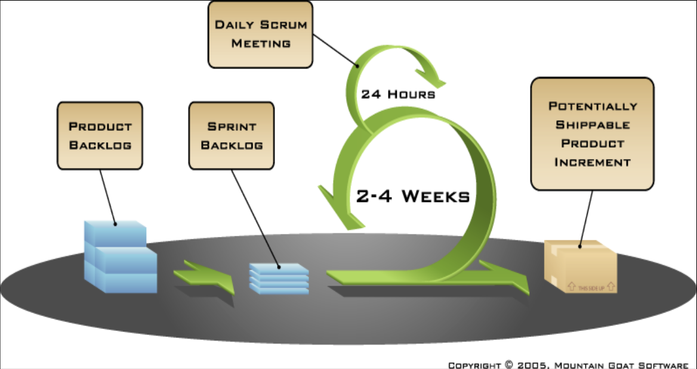
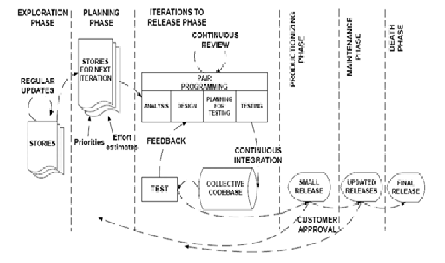
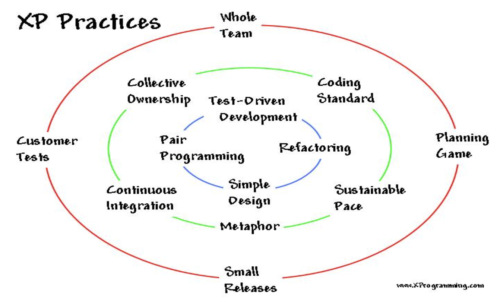

## Scrum

{ width=75% }

+ Process management framework
+ Facilitates incremental and iterative development
+ Does not specify software development techniques

### Phases

+ Pre-game phase
+ Development phase
+ Post-game phase

### Roles and responsibilities

+ Scrum Master
+ Product Owner
+ Scrum team
+ Customer
+ Management

### Practices

+ Product backlog
+ Effort estimation
+ Sprint
+ Sprint planning meeting
+ Sprint backlog
+ Daily Scrum meeting
+ Sprint review meeting
+ Sprint Retrospective

## Extreme Programming

+ Designed for small to medium teams
+ Based on 4 values: communication, simplicity, feedback and courage
+ Emphasizes on an onsite customer

{ width=75% }

{ width=75% }
