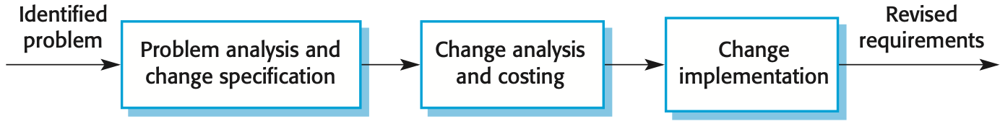

## Review of Previous Class

What are NFRs?

+ Shape the backlog
+ Provide metrics for us to measure our system against
  + As such NFRs must be testable
+ NFRs can be thought of as attributes of the system as opposed to capabilities

## Opening Quote

> The hardest single part of building a software system is deciding precisely what to build. No other part of the conceptual work is as difficult as establishing the detailed technical requirements, including all the interfaces to people, to machines, and to other software systems.
>
> No other part of the work so cripples the resulting system if done wrong. No other part is more difficult to rectify later.
> -- F.P.Brooks, “No Silver Bullet: The Essence and Accidents of Software Engineering,” IEEE Computer, April 1997

## Requirements Engineering

+ Can be defined as the systematic process of developing requirements through an iterative co-operative process of
  + Analyzing the problem
  + Documenting the resulting observations in a variety of representation formats
  + Checking the accuracy of the understanding gained
+ Is also a process in which "what to be done" is elicited, modeled, and communicated
+ A disciple for developing complete, consistent, unambiguous specifications
  + Serves as a basis for common agreement among all parties concerned
  + Describes what the product will do, but now how it will do it
+ The process of establishing the services that the customer requires from a system and the constraints under which it operates and is developed
+ The requirements themselves are the descriptions fo the system services and constraints that are generated during the requirements engineering process

## Definition of Requirement

1. A condition or capability needed by the suer to solve a problem or achieve an objective
2. A condition or capability tha tmust be met or possessed by a system or system component to satisfy a contract standard, specification, or other formally imposed document
3. A documented representation of a condition or capability as in (1) or (2).

A requirement may range from a high-level abstract statement of a service or of a system constraint to a detailed mathematical functional specification

This is inevitable as requirements may serve a dual function

+ May be the basis for a bid for the contract -- therefore they must be open to interpretation
+ May be the basis for the contract itself -- therefore must be defined in detail

Both of these statements may be called requirements.

## Types of Requirements

+ User requirements
  + Statements in natural language plus diagrams of the services the system provides and its operational constraints
  + Written for customers
+ System requirements
  + A structured document setting out detailed descriptions of the system's functions, services, and operational constraints
  + Defines what should be implemented so may be part of a contract between client and contractor

## User and System Requirements

As an example, let us look at a broad user-requirement broken down into system-requirement specifications:

1. The MHC-PMS shall generate monthly management reports showing the cost of drugs prescribed by each clinic during that month.
   1. On the last working day of each month, a summary of the drugs prescribed, their cost and the prescribing clinics shall be generated.
   2. The system shall automatically generate the report for printing after 17.30 on the last working day of the month.
   3. A report shall be created for each clinic and shall list the individual drug names, the total number of prescriptions, the number of doses prescribed and the total cost of the prescribed drugs.
   4. If drugs are available in different dose units (e.g. 10mg, 20 mg, etc.) separate reports shall be created for each dose unit.
   5. Access to all cost reports shall be restricted to authorized users listed on a management access control list.

## Functional and Non-Functional Requirements

### Functional requirements

+ Statements of services the system should provide, how the system should react to particular inputs, and how the system should behave in particular situations
+ May state what the system should not do

### Non-functional requirements

+ Constraints on the services or functions offered by the system such as timing constraints, constraints on the development process, standards, etc.
+ Often apply to the system as a whole rather than individual features or services

### Domain requirements

+ Constraints on the system form the domain of operation

## Functional Requirements

+ Describe functionality or system services
+ Depend on the type of software, expected users and the type of system where
the software is used
+ Functional user requirements may be high-level statements of what the system should do
+ Functional system requirements should describe the system services in detail

## Non-Functional Requirements

+ These define system properties and constraints e.g. reliability, response time and storage requirements.
+ Constraints are I/O device capability, system representations, etc.
+ Process requirements may also be specified mandating a particular IDE, programming language or development method
+ Non-functional requirements may be more critical than functional requirements. If these are not met, the system may be useless
+ Typically words that work as defining an attribute of a system can be considered NFRs
  + Saftey, security, reliability, scalability, etc.

## Implementing Non-Functional Requirements

+ Non-functional requirements may affect the overall architecture of a system rather than the individual components
  + For example, to ensure that performance requirement are met, you may have to organize the system to minimize communications between components
+ A single non-functional requirement, such as a security requirement, may generate a number of related functional requirements that define system services that are required
  + It may also generate requirements that restrict existing requirements

## Goals and Requirements

+ Non-functional requirements may be very difficult to state precisely and imprecise requirements may be difficult to verify
+ Goal
  + A general intention of the user such as ease of use
+ Verifiable non-functional requirement
  + A statement using some measure that can be objectively tested
+ Goals are helpful to developers as they convey the intentions of the system users

## Metrics for Specifying Non-Functional Requirements

+-------------+-----------------------------+
| Property    | Measure                     |
+=============+=============================+
| Speed       | Processed transactions/second\             |
|             | User/event response time\                  |
|             | Screen refresh time                        |
+-------------+--------------------------------------------+
| Size        | Mbytes\                                    |
|             | Number of ROM chips                        |
+-------------+--------------------------------------------+
| Ease of use | Training time\                             |
|             | Number of help frames                      |
+-------------+--------------------------------------------+
| Reliability | Mean time to failure\                      |
|             | Probability of unavailability\             |
|             | Rate of failure occurrence\                |
|             | Availability                               |
+-------------+--------------------------------------------+
| Robustness  | Time to restart after failure\             |
|             | Percentage of events causing failure\      |
|             | Probability of data corruption on failure  |
+-------------+--------------------------------------------+
| Portability | Percentage of target dependent statements\ |
|             | Number of target systems                   |
+-------------+--------------------------------------------+

## Domain Requirements

The system’s operational domain imposes requirements on the system.

+ For example, a train control system has to take into account the braking characteristics in different weather conditions.

Domain requirements can be new functional requirements, constraints on existing requirements or define specific computations.

If domain requirements are not satisfied, the system may be unworkable.

## Problems with Domain Requirements

### Understandability

+ Requirements are expressed in the language of the application domain
+ This is often not understood by software engineers developing the system

### Implicitness

+ Domain specialists understand the area so well that they do not think of making the domain requirements explicit

## Requirements Engineering Activities

Consists of

+ Elicitation
  + Getting the requirements
+ Analysis
  + Understanding needs/constraints of the user
+ Verification
  + Adequate & conforms to standards
+ Specification
  + Recording the requirements
+ Management
  + Planning and Controlling above activities

### Elicitation

The process through which the customers and developers of a software system discover, review, articulate, and understand the user needs and constraints of the software and development activity [Thayer 97].

+ Notes
  + Customers and developers share responsibility – Discover, articulate, and
review
  + Understand user needs and constraints

### Analysis

The process of analyzing the customers’ and users’ needs to arrive at a definition of software requirements [Thayer ’97]

+ Notes
  + Customer and user
+ Why the distinction?
  + Does NOT include analyzing characteristics of requirements – Validation?

### Verification

The process of ensuring that the software requirements specification is in compliance with the system requirements, conforms to document standards of the requirements phase, and is an adequate basis for preliminary design [Thayer ’97]

+ Notes
  + Compliance with system requirements
  + Conforms to document standards
  + Adequate basis for design
  + What is the role of requirements validation?

### Specification

The development of a document that clearly and precisely records each requirement of the software system [Thayer ’97]

+ Notes
  + Document production
  + Clear and precise
  + Is this Requirements Validation?

### Management

The planning and controlling of the requirements elicitation, specification, analysis, and verification activities.

+ How does one achieve effective RM? – Structured process and model
  + Effective process activities
  + Sufficient process artifacts
  + Tools
  + All of which require education of both the customer and developer

## Requirements Validation

+ Validity
  + Does the system provide the functions which best support the customer’s needs?
+ Consistency
  + Are there any requirements conflicts?
+ Completeness
  + Are all functions required by the customer included?
+ Realism/Feasibility
  + Can the requirements be implemented given available budget and technology?
+ Verifiability
  + Can the requirements be checked?
+ Unambiguous
  + One interpretation of each stated requirement.
+ Traceable
  + Origin and realization of each requirement should be clear.

## Requirements Evaluation

Consists of five attributes

+ Unambiguity
+ Completeness
+ Consistency
+ Testable
+ Traceable

### Unambiguity

A requirement is unambiguous if and only if it has only one possible interpretation

+ The specification “The control total is taken from the last record”, might be read as:
  + The control total is taken from the record at the end of the file – the control total is taken from the latest record
  + The control total is taken from the previous record

### Completeness

The degree to which all of the software’s required functions and design constraints are present and fully developed in the SRS, SDD, and code.

+ No requirement or need of the user has been overlooked
+ The system response has been specified for every possible set of inputs – for every output produced, there is a consuming function

Any SRS that uses the phrase “to be determined” (TBD) is not a complete SRS

### Consistency

An SRS is consistent if and only if no set of individual requirements described in it conflict.

+ Two or more requirements might describe an object using different terms for that object
  + Request for user input called a prompt in one requirement and a cue in another – characteristics of an object might conflict
  + Format of report described in one requirement as tabular but in another as textual
+ Logical or temporal conflicts between two specified actions » A must always follow B --- A and B occur simultaneously

### Testable

The degree to which a requirement is stated in terms that permit establishment of test criteria and performance of tests to determine whether those criteria have been met.

+ Product should work well
+ Requirement cannot be verified because it is impossible to define the term well

### Traceable

SRS is traceable if the origin of each of its requirement is clear and if it facilitates referencing of each requirement in future development or enhancement documentation.

Two types of traceability are recommended:

+ Backward traceability (to previous stages of development)
  + Depends upon each requirement explicitly referencing its source in previous
documents
+ Forward traceability (to all documents spawned by the SRS)
  + Depends upon each requirement in SRS having unique name or reference number

## Participants

+ Customer
+ User
+ Requirements Engineer(Or Analyst)
+ Developer
+ V&V agent

Who else do you think should participate in the RE process?

## Artifacts

+ Requirements
  + What is the system to do?
  + Who identified the requirement?
  + Contextual information
+ Where does it fit?
+ Justification(in special cases)
+ Validation and Verification audit reports
+ Requirements Specification
+ Output of the Requirements Management Tool

## Requirements Change Management

+ Deciding if a requirements change should be accepted
  + Problem analysis and change specification
  + Change analysis and costing
  + Change implementation

{ width=75% }

## Natural Langauge Specification

+ Requirements are written as natural language sentences supplemented by diagrams and tables
+ Used for writing requirements because it is expressive, intuitive and universal. This means that the requirements can be understood by users and customers

## Guidelines for Writing Requirements

+ Invent a standard format and use it for all requirements
+ Use language in a consistent way. Use shall for mandatory requirements should for desirable requirements
+ Use text highlighting to identify key parts of the requirement
+ Avoid the use of computer jargon
+ Include an explanation (rationale) of why a requirement is necessary

## Problems with Natural Language

+ Lack of clarity
  + Precision is difficult without making the document difficult to read.
+ Improper Classification
  + Functional and non-functional requirements tend to be mixed-up.
+ Requirements amalgamation
  + Several different requirements may be expressed together.

## Communication

+ Listen
+ Prepare before you communicate
+ Facilitate the communication
+ Face-to-face is best
+ Take notes and document decisions Collaborate with the customer
+ Stay focused
+ Draw pictures when things are unclear
+ Move on...
+ Negotiation works best when both parties win
