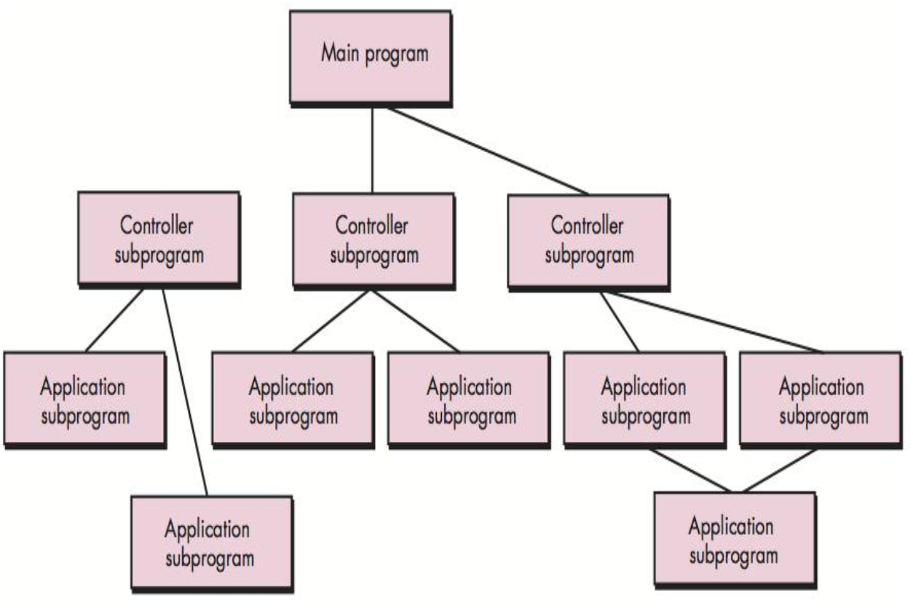

## Review of Previous Class

## Architecture

The DoD says that architecture is the

> The structure of components, their relationships, and the principles and guidelines governing their design and evolution over time.
>
> [DoD Integrated Architecture Panel, 1995, based on IEEE STD 610.12]

The IEEE says

> An architecture is the fundamental organization of a system embodied in its components, their relationships to each other, and to the environment, and the principles guiding its design and evolution.
>
> [IEEE STD 1471-2000]

Bass, Clements, and Kazman say

> The software architecture of a program or computing system is the structure or structures of the system, which comprise software components, the externally visible properties of those components, and the relationships among them.
>
> [Bass, Clements, and Kazman, 2003]

> A software system’s architecture is the set of principal design decisions made about the system.

> ... blueprint for a software system’s construction and evolution.

> A reference architecture is the set of principal design decisions that are simultaneously applicable to multiple related systems, typically within an application domain, with explicitly defined points of variation.
>
> [Taylor, et.al 2010]

## Architecure vs. Design

> There is a distinct difference between the terms architecture and design. A design is an instance of an architecture similar to an object being an instance of a class. For example, consider the client-server architecture. I can design a network-centric software system in many different ways from this architecture using either the Java platform (Java EE) or Microsoft platform (.NET framework). So, there is one architecture, but many designs can be created based on that architecture. Therefore, you cannot mix “architecture” and “design” with each other.
>
> [Dr.Osman Balci, Virginia Tech]

## Why Architecture is Important

Representations of software architecture are an enabler for communication between all parties (stakeholders) interested in the development of a computer-based system.

The architecture highlights early design decisions that will have a profound impact on all software engineering work that follows and, as important, on the ultimate success of the system as an operational entity.

> Architecture constitutes a relatively small, intellectually graspable model of how the system is structured and how its components work together
>
> [Bass, Clements, and Kazman, 2003]

## Software Architecture

Provides an intermediate level of abstraction between – User Needs / Requirements

+ Design Elements
+ Data Structures
+ Algorithms

## Architectural Decisions

+ Is there a generic application architecture that can be used?
+ How will the system be distributed?
+ What architectural styles are appropriate?
+ What approach will be used to structure the system?
+ How will the system be decomposed into modules?
+ What control strategy should be used?
+ How will the architecture be evaluated?
+ How should the architecture be documented?

## Architectural Reuse

+ Systems in the same domain often have similar architectures that reflect domain concepts
+ Application product lines are built around a core architecture with variants that satisfy particular customer requirements
+ The architecture of a system may be designed around one of more architectural patterns or ‘styles’

## Architectural Description

> A collection of products to document an architecture.
>
> [IEEE STD 1471-2000]

Represented using multiple views

> A view is a representation of a whole system from the perspective of a related set of [stakeholder] concerns.
>
> A viewpoint is a specification of the conventions for constructing and using a view.
>
> [IEEE STD 1471-2000]

## 4 + 1 View Model of Software Architecture

+ A logical view, which shows the key abstractions in the system as objects or object classes.
+ A process view, which shows how, at run-time, the system is composed of interacting processes.
+ A development view, which shows how the software is decomposed for development.
+ A physical view, which shows the system hardware and how software components are distributed across the processors in the system.
+ Related using use cases or scenarios (+1)

## Architecture Framework

A set of tools which can be used for developing a broad range of different architectures. It should:

+ describe a method for defining an information system in terms of a set of building blocks
+ show how the building blocks fit together
+ contain a set of tools
+ provide a common vocabulary
+ include a list of recommended standards
+ include a list of compliant products that can be used to implement the building blocks

DoDAF, TOGAF, MODAF, Zachman, etc.

## Architectural Pattern

+ Named collection of architectural design decisions
+ Applicable to a recurring design problem
+ Parameterized to account for different software development contexts

## Architectural Patterns

+ Patterns are a means of representing, sharing and reusing knowledge.
+ An architectural pattern is a stylized description of good design practice, which has been tried and tested in different environments.
+ Patterns should include information about when they are and when the are not useful.
+ Patterns may be represented using tabular and graphical descriptions.

## Architecture and NFRs

The following are several NFRs are the corresponding architectural pattern which enables them

+ Performance
  + Localize critical operations and minimize communications. Use large rather than fine-grain components.
+ Security
  + Use a layered architecture with critical assets in the inner layers.
+ Safety
  + Localize safety-critical features in a small number of sub-systems.
+ Availability
  + Include redundant components and mechanisms for fault tolerance.
+ Maintainability
  + Use fine-grain, replaceable components.

Notice how almost all of them are in conflict with each other?

## Data-Centric Architecture

{ width=50% }

+ NFRs
  + Modifiability
  + Scalability
+ Examples
  + DBMS
  + Library Information Systems
  + Voice and Image recognition systems
+ Shortcomings
  + Data store reliability and availability can be compromised

## Data-Flow Architecture

{ width=50% }

+ NFRs
  + Reusability
  + Modifiability
+ Examples
  + Batch processing systems
  + Compilers
  + UNIX pipes
+ Shortcomings
  + Unsuitable for dynamic interactions

## Call-and-Return Architecture

{ width=50% }

+ NFRs
  + Scalability
  + Modifiability
+ Examples
  + Java programs -- the main method calls other methods
+ Shortcomings
  + Global data (if any) introduces vulnerabilities
  + Tight coupling can cause ripple effects when changes are made

## Layered Architecture

{ width=50% }

+ NFRs
  + Protability
  + Modifiability
  + Reusability
  + Security
+ Examples
  + Microsoft's .NET platform
  + ISO OSI 7-layer model
+ Shortcomings
  + Runtime performance can be impacted

## Client-Server Architecture

{ width=50% }

+ NFRs
  + Modifiability
  + Reusability
+ Examples
  + Email servers and clients
+ Shortcomings
  + Server availability can be impacted and scalability can be compromised
  + Performance may be unpredictable

## Service-Oriented Architecture

{ width=50% }

+ NFRs
  + Interoperability
  + Reusability
  + Scalability
  + Availability
+ Examples
  + Amazon Web Services
+ Shortcomings
  + Complex service management
  + Increased overhead can impact performance

## Architecure Tradeoff Analysis Method

1. Collect scenarios.
2. Elicit requirements, constraints, and environment description.
3. Describe the architectural styles/patterns that have been chosen to address the scenarios and requirements.
4. Evaluate quality attributes by considering each attribute in isolation.
5. Identify the sensitivity of quality attributes to various architectural attributes for a specific architectural style.
6. Critique candidate architectures.

See <https://resources.sei.cmu.edu/asset_files/TechnicalReport/2000_005_001_13706.pdf> for more.

## Potential Tradeoffs

+ Scalability and performance
+ Reliability and performance
+ Storage constraints and speed
+ Maintainability and performance

## Additional Resources

+ Software Architecture and Design Illuminated, Qian, Fu, Tao, et.al, Jones Bartlett, 2010
+ Software Architecture in Practice, Bass, Clements, and Kazman, 3rd Edition, Addison Wesley, 2013
+ What is Software Architecture? <http://www.youtube.com/watch?v=Rn1g6V-vlHw>
+ Types of Architectural Styles <https://www.youtube.com/watch?v=JLbo9Lvvy5M>
+ Designing an Alarm Clock <http://www.youtube.com/watch?v=PliHAP5m0BE>
