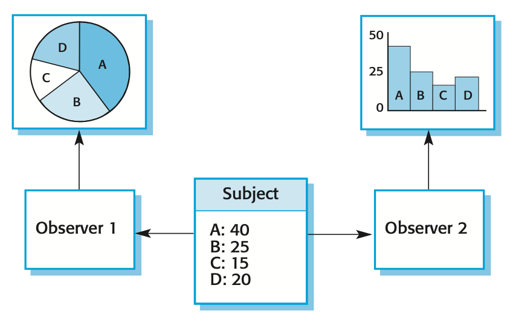
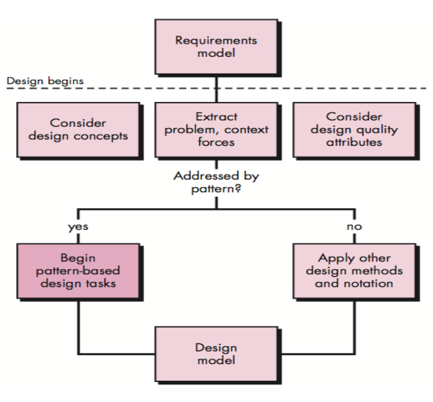

## Software Design

+ Design brings together stakeholder requirements, business needs, and technical considerations to formulate a product
+ Answers the question "how?"

### Goals

+ Must implement all of the explicit requirements contained in the analysis model, and it must accommodate all of the implicit requirements desired by the customer
+ Must be a readable, understandable guide for those who generate code and for those who test and subsequently support the software
+ Should provide a complete picture of the software, addressing the data, functional, and behavioral domains from an implementation perspective

## Design Guidelines

+ Should exhibit an architecture that

    (1) has been created using recognizable architectural styles or patterns
    (2) is composed of components that exhibit good design characteristics and
    (3) can be implemented in an evolutionary fashion

+ Should be modular; that is, the software should be logically partitioned into elements or subsystems
+ Should contain distinct representations of data, architecture, interfaces, and components
+ Should lead to data structures that are appropriate for the classes to be implemented and are drawn from recognizable data patterns
+ A design should lead to components that exhibit independent functional characteristics.
+ A design should lead to interfaces that reduce the complexity of connections between components and with the external environment
+ A design should be derived using a repeatable method that is driven by information obtained during software requirements analysis
+ A design should be represented using a notation that effectively communicates its meaning

## Design Principles

+ The design process should not suffer from ‘tunnel vision’
+ The design should be traceable to the analysis model
+ The design should not reinvent the wheel
+ The design should “minimize the intellectual distance” between the software and the problem as it exists in the real world
+ The design should exhibit uniformity and integration
+ The design should be structured to accommodate change
+ Design is not coding, coding is not design
+ The design should be assessed for quality as it is being created, not after the fact
+ The design should be reviewed to minimize conceptual (semantic) errors

## Design Concepts

+ Abstraction
+ Separation of concerns
+ Modularity
+ Information hiding
+ Functional Independence • Refinement
+ Refactoring

## Design Patterns

+ A design pattern is a way of reusing abstract knowledge about a problem and its solution
+ A pattern is a description of the problem and the essence of its solution
+ It should be sufficiently abstract to be reused in different settings
+ Pattern descriptions usually make use of object-oriented characteristics such as inheritance and polymorphism

## Pattern Elements

+ Name
  + A meaningful pattern identifier
+ Problem description
+ Solution description
  + Not a concrete design but a template for a design solution which can be instantiated in different ways
+ Consequences
  + The results and trade-offs of applying the pattern

## The Observer Pattern

### Name

Observer

### Description

Separates the display of the state of an object from the object itself and allows alternative displays to be provided. When the object state changes, all displays are automatically notified and updated to reflect the change.

### Problem description

In many situations, you have to provide multiple displays of state information, such as a graphical display and a tabular display. Not all of these may be known when the information is specified. All alternative presentations should support interaction and, when the state is changed, all displays must be updated.

This pattern may be used in all situations where more than one display format for state information is required and where it is not necessary for the object that maintains the state information to know about the specific display formats used.

### Solution description

This involves two abstract objects, `Subject` and `Observer`, and two concrete objects, `ConcreteSubject` and `ConcreteObject`, which inherit the attributes of the related abstract objects. The abstract objects include general operations that are applicable in all situations. The state to be displayed is maintained in `ConcreteSubject`, which inherits operations from `Subject` allowing it to add and remove `Observer`s (each observer corresponds to a display) and to issue a notification when the state has changed.

The `ConcreteObserver` maintains a copy of the state of `ConcreteSubject` and implements the `Update()` interface of `Observer` that allows these copies to be kept in step. The `ConcreteObserver` automatically displays the state and reflects changes whenever the state is updated.

### Consequences

The subject only knows the abstract `Observer` and does not know details of the concrete class. Therefore there is minimal coupling between these objects. Because of this lack of knowledge, optimizations that enhance display performance are impractical. Changes to the subject may cause a set of linked updates to observers to be generated, some of which may not be necessary.

{ width=50% }

## Design Problems

Recognize that any design problem you are facing may have an associated pattern which can be applied.

{ width=50% }

+ To use patterns in your design, you need to recognize that any design problem you are facing may have an associated pattern that can be applied.
  + Tell several objects that the state of some other object has changed (Observer pattern)
  + Tidy up the interfaces to a number of related objects that have often been developed incrementally (Façade pattern)
  + Provide a standard way of accessing the elements in a collection, irrespective of how that collection is implemented (Iterator pattern)
  + Allow for the possibility of extending the functionality of an existing class at run- time (Decorator pattern)

## Implementation Issues

The focus here is not on programming, although this is obviously important, but on other implementation issues:

+ Reuse
+ Configuration management
+ Host-target development

## Design and Implementation

Software design and implementation activities are invariably inter-leaved.

+ Software design is a creative activity in which you identify software components and their relationships, based on a customer’s requirements
+ Implementation is the process of realizing the design as a program

## Task Set for Software Design

1. Examine the information domain model, and design appropriate data structures for data objects and their attributes
2. Using the analysis model, select an architectural style that is appropriate for the software
3. Partition the analysis model into design subsystems and allocate these subsystems within the architecture
4. Create a set of design classes or components
5. Design any interface required with external systems or devices
6. Design the user interface
7. Conduct component-level design
8. Develop a deployment model

## Design Metrics

+ Class size
+ Methods per class
+ Cohesion (avoid too many methods with dissimilar purpose)
+ Coupling between classes (we want to keep this low)
+ Depth of inheritance tree
+ Method complexity

## Key Points

+ Software design and implementation are inter-leaved activities. The level of detail in the design depends on the type of system and whether you are using a plan-driven or agile approach.
+ The process of object-oriented design includes activities to design the system architecture, identify objects in the system, describe the design using different object models and document the component interfaces.
+ A range of different models may be produced during an object-oriented design process. These include static models (class models, generalization models, association models) and dynamic models (sequence models, state machine models).
+ Component interfaces must be defined precisely so that other objects can use them. A UML interface stereotype may be used to define interfaces.
