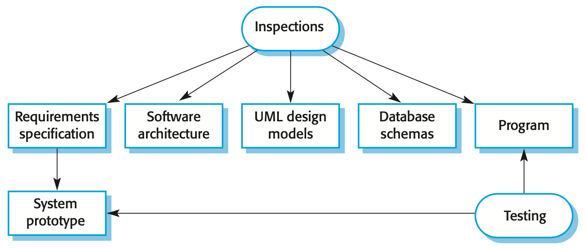

## Testing

+ Testing is intended to show that a program does what it is intended to do and to discover program defects before it is put into use
+ When you test software, you execute a program using artificial data
+ You check the results of the test run for errors, anomalies or information about the program’s non-functional attributes
+ Can reveal the presence of errors and NOT their absence
+ Testing is part of a more general verification and validation process, which also includes static validation techniques

## Testing Goals

+ To demonstrate to the developer and the customer that the software meets its requirements
+ To discover situations in which the behavior of the software is incorrect, undesirable or does not conform to its specification

## Validation and Defect Testing

+ The first goal leads to validation testing
  + You expect the system to perform correctly using a given set of test cases that reflect the system’s expected use
+ The second goal leads to defect testing 
  + The test cases are designed to expose defects. The test cases in defect testing can be deliberately obscure and need not reflect how the system is normally used

## Verification vs. Validation

+ Verification: Are we building the product right?
  + The software should conform to its specification
+ Validation: Are we building the right product?
  + The software should do what the user really requires

## V & V Confidence

+ The aim of V & V is to establish confidence that the system is 'fit for purpose'
+ Depends on system’s purpose, user expectations and marketing environment
  + Software purpose
    + The level of confidence depends on how critical the software is to an organization
  + User expectations
    + Users may have low expectations of certain kinds of software
  + Marketing environment
    + Getting a product to market early may be more important than finding defects in the program

## Inspection and Testing

{ width=75% }

+ **Software inspections**: Concerned with analysis of the static system representation to discover problems (static verification)
  + May be supplement by tool-based document and code analysis
+ **Software testing**: Concerned with exercising and observing product behavior (dynamic verification)
  + The system is executed with test data and its operational behavior is observed

## Software Inspections

+ These involve people examining the source representation with the aim of discovering anomalies and defects
+ Inspections do not require execution of a system and so may be used before implementation
+ They may be applied to any representation of the system (requirements, design, configuration data, test data, etc.)
+ They have been shown to be an effective technique for discovering program errors

## Advantages of Inspections

+ Since inspection is a static process, you don’t have to be concerned with interactions between errors
+ Incomplete versions of a system can be inspected without additional costs
+ As well as searching for program defects, an inspection can also consider broader quality attributes of a program, such as compliance with standards, portability and maintainability

## Inspections and Testing

+ Inspections and testing are complementary and not opposing verification techniques
+ Both should be used during the V & V process
+ Inspections can check conformance with a specification but not conformance with the customer’s real requirements
+ Inspections cannot check non-functional characteristics such as performance, usability, etc.

## Stages of Testing

+ Development testing
  + The system is tested during development to discover bugs and defects
+ Release testing
  + A separate testing team tests a complete version of the system before it is released to users
+ User testing
  + Users or potential users of a system test the system in their own environment

## Development Testing

+ Development testing includes all testing activities that are carried out by the team developing the system
  + Unit testing
  + Component testing
  + System testing

## Unit Testing

+ Unit testing is the process of testing individual components in isolation.
+ It is a defect testing process.
+ Units may be:
  + Individual functions or methods
  + Object classes with several attributes and methods

## Automated Testing

+ Whenever possible, unit testing should be automated so that tests are run and checked without manual intervention
+ In automated unit testing, you make use of a test automation framework (such as JUnit) to write and run your program tests
+ Unit testing frameworks provide generic test classes that you extend to create specific test cases

## General Testing Guidelines

+ Choose inputs that force the system to generate all error messages
+ Design inputs that cause input buffers to overflow
+ Repeat the same input or series of inputs numerous times
+ Force invalid outputs to be generated
+ Force computation results to be too large or too small

## Component Testing

+ Software components are often composite components that are made up of several interacting objects
+ You access the functionality of these objects through the defined component interface
+ Testing composite components should therefore focus on showing that the component interface behaves according to its specification

## Regression Testing

+ Regression testing is testing the system to check that changes have not ‘broken’ previously working code
+ In a manual testing process, regression testing is expensive but, with automated testing, it is simple and straightforward. All tests are rerun every time a change is made to the program
+ Tests must run ‘successfully’ before the change is committed

## System Testing

+ Involves integrating components to create a version of the system and then testing the integrated system
+ The focus is on testing the interactions between components
+ Checks that components are compatible, interact correctly and transfer the right data at the right time across their interfaces
+ Tests the emergent behavior of a system

## Release Testing

+ Release testing is the process of testing a particular release of a system that is intended for use outside of the development team
+ The primary goal of the release testing process is to convince the supplier of the system that it is good enough for use
+ Release testing is usually a black-box testing process where tests are only derived from the system specification

## User Testing

+ User or customer testing is a stage in the testing process in which users or customers provide input and advice on system testing
+ User testing is essential, even when comprehensive system and release testing have been carried out

## Types of User Testing

+ Alpha testing
  + Users of the software work with the development team to test the software at the developer’s site
+ Beta testing
  + A release of the software is made available to users to allow them to experiment and to raise problems that they discover with the system developers
+ Acceptance testing
  + Customers test a system to decide whether or not it is ready to be accepted from the system developers and deployed in the customer environment. Primarily for custom systems

## Acceptance Testing Process

+ Define acceptance criteria
+ Plan acceptance testing
+ Derive acceptance tests
+ Run acceptance tests
+ Negotiate test results
+ Reject/accept system

## Key Points

+ Testing can only show the presence of errors in a program. It cannot demonstrate that there are no remaining faults
+ Development testing is the responsibility of the software development team
+ Development testing includes unit testing, component testing, and system testing
+ When testing software, you should try to ‘break’ the software
+ Wherever possible, you should write automated tests. The tests are embedded in a program that can be run every time a change is made to a system
+ Acceptance testing is a user testing process where the aim is to decide if the software is good enough to be deployed and used in its operational environment
