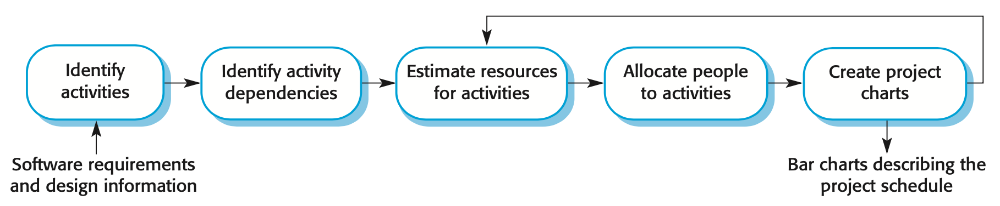
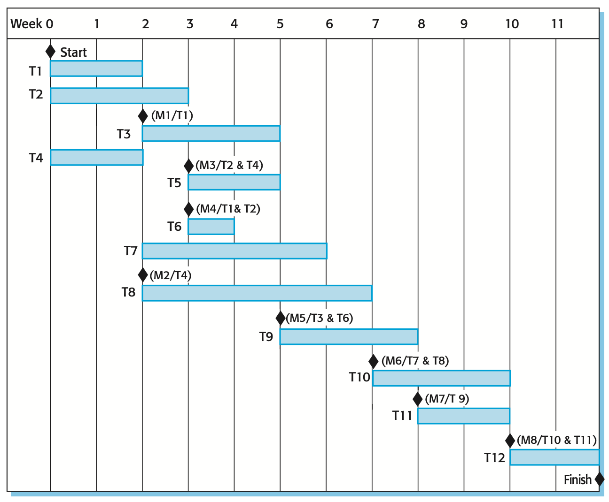
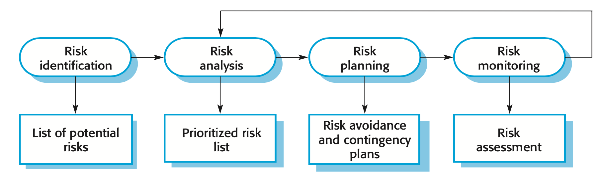

## Software Project Management

+ Concerned with activities involved in ensuring that software is
  + *delivered on time*,
  + *within budget*, and
  + *in accordance with the requirements* of the organizations developing and procuring the software
+ Is needed because software development is always subject to budget and schedule constraints that are set by the organization developing the software

## Success Criteria

+ Deliver the software to the customer at the agreed time
+ Keep overall costs within budget
+ Deliver software that meets the customer’s expectations
+ Maintain a coherent and well-functioning development team

## Factors Influencing Project Management

These factors mean that project managers in different organizations may work in quite different ways

+ Company size
+ Software customers
+ Software size
+ Software type
+ Organizational culture
+ Software development processes

## Management Activities

+ Project planning
+ Reporting
+ Risk management
+ People management
+ Proposal writing

## Project Planning

+ Project planning involves
  + breaking down the work into parts and assign these to project team members,
  + anticipate problems that might arise and prepare tentative solutions to those problems
+ The project plan, which is created at the start of a project, is used to communicate how the work will be done to the project team and customers, and to help assess progress on the project

## Project Scheduling

{ width=75% }

+ Project scheduling is the process of deciding how the work in a project will be organized as separate tasks, and when and how these tasks will be executed
+ Split project into tasks and estimate time and resources required to complete each task
+ Organize tasks concurrently to make optimal use of workforce
+ Minimize task dependencies to avoid delays caused by one task waiting for another to complete
+ Dependent on project managers intuition and experience

## Scheduling Problems

+ Estimating the difficulty of problems and hence the cost of developing a solution is hard
+ Productivity is not proportional to the number of people working on a task
+ Adding people to a late project makes it later because of communication overheads
+ The unexpected always happens. Always allow contingency in planning

## Schedule Representation

+ Graphical notations are normally used to illustrate the project schedule
+ These show the project breakdown into tasks. Tasks should not be too small -- they should take about a week or two
+ Bar charts are the most commonly used representation for project schedules. They show the schedule as activities or resources against time

## Tasks, Durations, and Dependencies

Task | Effort (Person-Days) | Duration (Days) | Dependencies
:---: | :---:| :---:| :---:|
T1 | 15 | 10 | |
T2 | 8 | 15 | |
T3 | 20 | 15 | T1 (M1) |
T4 | 5 | 10 | |
T5 | 5 | 10 | T2, T4 (M3) |
T6 | 10 | 5 | T1, T2 (M4) |
T7 | 25 | 20 | T1 (M1) |
T8 | 75 | 25 | T4 (M2) |
T9 | 10 | 15 | T3, T6 (M5) |
T10 | 20 | 15 | T7, T8 (M6) |
T11 | 10 | 10 | T9 (M7) |T
12 | 20 | 10 | T10, T11 (M8) |

## Activity Bar Chart

{ width=50% }

## Staff Allocation Chart

{ width=50% }

## Risk Management

+ Risk management is concerned with identifying risks and drawing up plans to minimize their effect on a project
+ A risk is a probability that some adverse circumstance will occur
  + Project risks affect schedule or resources
  + Product risks affect the quality or performance of the software being developed
  + Business risks affect the organization developing or procuring the software

## Examples of Common Risks

Risk | Affects | Description |
:-- | :-- | :----- |
Staff turnover | Project | Experienced staff will leave the project before it is finished. |
Management change | Project | There will be a change of organizational management with different priorities. |
Hardware unavailability | Project | Hardware that is essential for the project will not be delivered on schedule. |
Requirements change | Project and product | There will be a larger number of changes to the requirements than anticipated. |
Specification delays | Project and product | Specifications of essential interfaces are not available on schedule. |
Size underestimate | Project and product | The size of the system has been underestimated. |
CASE tool under-performance | Product | CASE tools, which support the project, do not perform as anticipated. |
Technology change | Business | The underlying technology on which the system is built is superseded by new technology. |
Product competition | Business | A competitive product is marketed before the system is completed. |

## The Risk Management Process

{ width=75% }

+ Risk identification
  + Identify project, product and business risks
+ Risk analysis
  + Assess the likelihood and consequences of these risks
+ Risk planning
  + Draw up plans to avoid or minimize the effects of the risk
+ Risk monitoring
  + Monitor the risks throughout the project

## Risk Identification

+ May be a team activity or based on the individual project manager’s experience
+ A checklist of common risks may be used to identify risks in a project
  + Technology risks
  + People risks
  + Organizational risks
  + Requirements risks
  + Estimation risks

## Risk Analysis

+ Assess probability and seriousness of each risk
+ Probability may be very low, low, moderate, high or very high
+ Risk consequences might be catastrophic, serious, tolerable or insignificant

## Risk Planning

Consider each risk and develop a strategy to manage that risk.

+ **Avoidance strategies**
  + The probability that the risk will arise is reduced
+ **Minimisation strategies**
  + The impact of the risk on the project or product will be reduced
+ **Contingency plans**
  + If the risk arises, contingency plans are plans to deal with that risk

## Risk Monitoring

+ Assess each identified risks regularly to decide whether or not it is becoming less or more probable
+ Also assess whether the effects of the risk have changed
+ Each key risk should be discussed at management progress meetings

## Managing People

+ People are an organization's most important assets
+ The tasks of a manager are essentially people-oriented. Unless there is some understanding of people, management will be unsuccessful
+ Poor people management is an important contributor to project failure

## People Management Factors

+ **Consistency**
  + Team members should all be treated in a comparable way without favorites or discrimination
+ **Respect**
  + Different team members have different skills and these differences should be respected
+ **Inclusion**
  + Involve all team members and make sure that people’s views are considered
+ **Honesty**
  + You should always be honest about what is going well and what is going badly in a project

## Teamwork

+ Most software engineering is a group activity
+ A good group is cohesive and has a team spirit
+ Group interaction is a key determinant of group performance
+ Flexibility in group composition is limited
  + Managers must do the best they can with available people

## Group Cohesiveness

+ In a cohesive group, members consider the group to be more important than any individual in it

## The Effectiveness of a Team

+ The people in the group
+ The group organization
+ Technical and managerial communications

## Selecting Group Members

+ A manager or team leader’s job is to create a cohesive group and organize their group so that they can work together effectively
+ This involves creating a group with the right balance of technical skills and personalities, and organizing that group so that the members work together effectively

## Assembling a Team

+ May not be possible to appoint the ideal people to work on a project
  + Project budget may not allow for the use of highly-paid staff;
  + Staff with the appropriate experience may not be available;
  + An organization may wish to develop employee skills on a software project.
+ Managers have to work within these constraints especially when there are shortages of trained staff

## Group Composition

+ Group composed of members who share the same motivation can be problematic
  + Task-oriented - everyone wants to do their own thing;
  + Self-oriented - everyone wants to be the boss;
  + Interaction-oriented - too much chatting, not enough work.
+ An effective group has a balance of all types
+ This can be difficult to achieve software engineers are often task-oriented
+ Interaction-oriented people are very important as they can detect and defuse tensions that arise

## Group Organization

Key questions include:

+ Should the project manager be the technical leader of the group?
+ Who will be involved in making critical technical decisions, and how will these be made?
+ How will interactions with external stakeholders and senior company management be handled?
+ How can groups integrate people who are not co-located?
+ How can knowledge be shared across the group?

## Group Communications

+ Good communications are essential for effective group working
+ Information must be exchanged on the status of work, design decisions and changes to previous decisions
+ Good communications also strengthens group cohesion as it promotes understanding

## Key Points

+ Good project management is essential if software engineering projects are to be developed on schedule and within budget.
+ Software management is distinct from other engineering management. Software is intangible. Projects may be novel or innovative with no body of experience to guide their management. Software processes are not as mature as traditional engineering processes.
+ Risk management involves identifying and assessing project risks to establish the probability that they will occur and the consequences for the project if that risk does arise. You should make plans to avoid, manage or deal with likely risks if or when they arise.
+ People management involves choosing the right people to work on a project and organizing the team and its working environment.
+ People are motivated by interaction with other people, the recognition of management and their peers, and by being given opportunities for personal development.
+ Software development groups should be fairly small and cohesive. The key factors that influence the effectiveness of a group are the people in that group, the way that it is organized and the communication between group members.
+ Communications within a group are influenced by factors such as the status of group members, the size of the group, the gender composition of the group, personalities and available communication channels.
