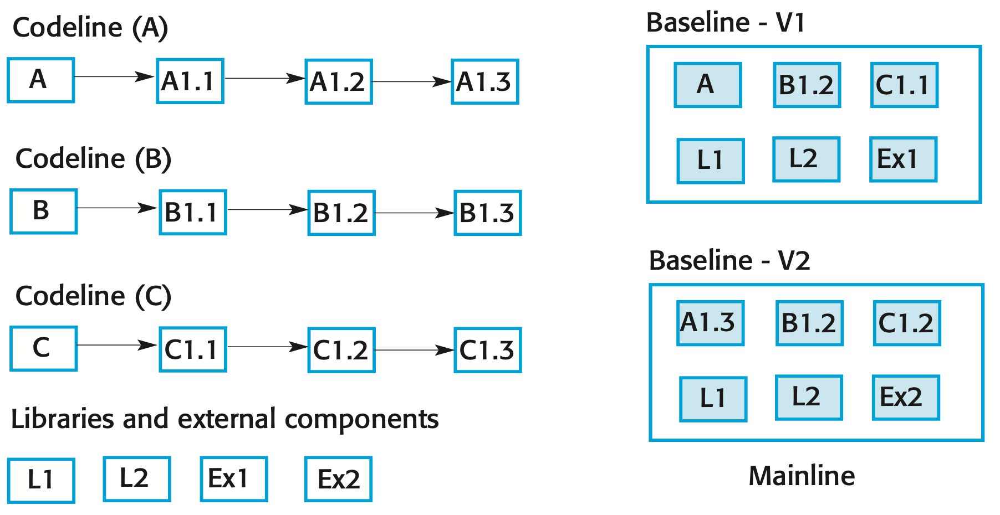
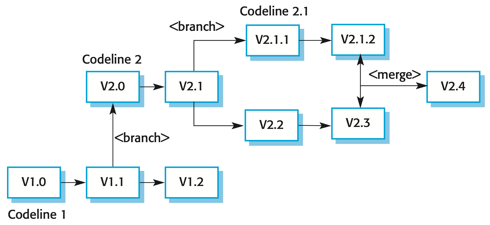
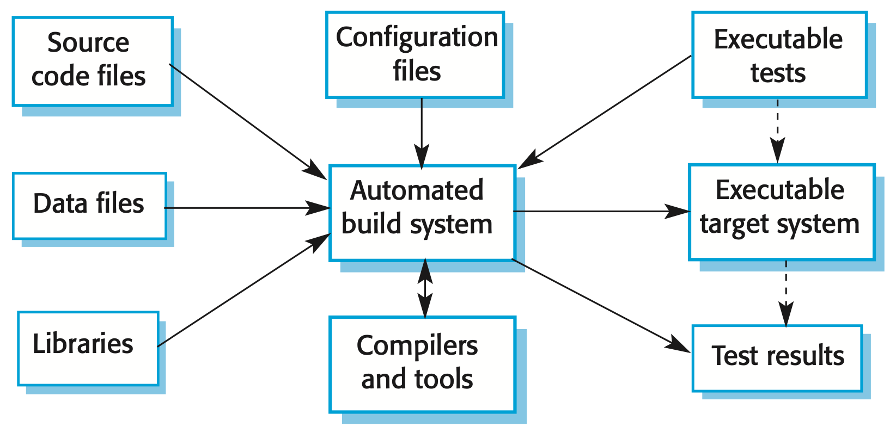
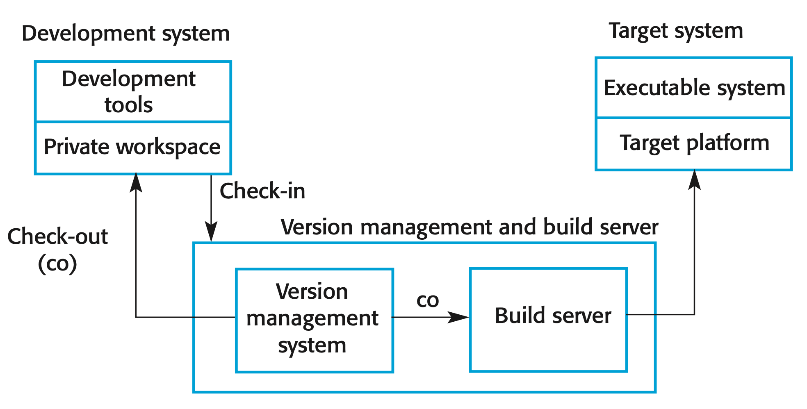

## Configuration Management

*Configuration management (CM) is concerned with the policies, processes, and tools for managing changing software systems.*

+ Software changes frequently, and systems, can be thought of as a set of versions, each of which has to be maintained and managed
+ Versions implement proposals for change, corrections of faults, and adaptations for different hardware and operating systems

## CM Activities

+ **Version management**
  + Keeping track of the multiple versions of system components
  + Ensuring that changes made to components by different developers do not interfere with each other
+ **System building**
  + Assembling program components, data and libraries, then compiling these to create an executable system
+ **Change management**
  + Keeping track of requests for changes to the software from customers and developers
  + Working out the costs and impact of changes
  + Deciding which changes should be implemented
+ **Release management**
  + Preparing software for external release
  + Keeping track of the system versions that have been released for customer use

## CM Terminology

Term | Explanation |
:- | :------- |
Configuration item or software configuration item (SCI) | Anything associated with a software project (design, code, test data, document, etc.) that has been placed under configuration control. There are often different versions of a configuration item. Configuration items have a unique name. |
Configuration control | The process of ensuring that versions of systems and components are recorded and maintained so that changes are managed and all versions of components are identified and stored for the lifetime of the system. |
Version | An instance of a configuration item that differs, in some way, from other instances of that item. Versions always have a unique identifier, which is often composed of the configuration item name plus a version number. |
Baseline | A baseline is a collection of component versions that make up a system. Baselines are controlled, which means that the versions of the components making up the system cannot be changed. This means that it should always be possible to recreate a baseline from its constituent components. |
Codeline | A codeline is a set of versions of a software component and other configuration items on which that component depends. |
Mainline | A sequence of baselines representing different versions of a system. |
Release | A version of a system that has been released to customers (or other users in an organization) for use. |
Workspace | A private work area where software can be modified without affecting other developers who may be using or modifying that software. |
Branching | The creation of a new codeline from a version in an existing codeline. The new codeline and the existing codeline may then develop independently. |
Merging | The creation of a new version of a software component by merging separate versions in different codelines. These codelines may have been created by a previous branch of one of the codelines involved. |
System building | The creation of an executable system version by compiling and linking the appropriate versions of the components and libraries making up the system. |

## Version Management

+ Version management (VM) is the process of keeping track of different versions of software components or configuration items and the systems in which these components are used
+ Also involves ensuring that changes made by different developers to these versions do not interfere with each other

## Codelines and Baselines

{ width=75% }

+ A codeline is a set of versions of a software component and other configuration items on which that component depends
+ A baseline is a collection of component versions that make up a system

## Version Control System

+ Identify, store, and control access to the different versions of components
+ Two types of modern version control systems
+ **Centralized**
  + Single master repository that maintains all versions of the software components that are being developed
  + Example: Subversion
+ **Distributed**
  + Multiple versions of the component repository exist at the same time
  + Example: Git

## Centralized Version Control

+ Developers check out components or directories of components from the project repository into their private workspace and work on these copies in their private workspace
+ When their changes are complete, they check-in the components back to the repository
+ If several people are working on a component at the same time, each check it out from the repository. If a component has been checked out, the VC system warns other users wanting to check out that component that it has been checked out by someone else

## Distributed Version Control

+ A ‘master’ repository is created on a server that maintains the code produced by the development team
+ Instead of checking out the files that they need, a developer creates a clone of the project repository that is downloaded and installed on their computer
+ Developers work on the files required and maintain the new versions on their private repository on their own computer
+ When changes are done, they ‘commit’ these changes and update their private server repository. They may then ‘push’ these changes to the project repository

## Benefits of Distributed Version Control

+ Provides a backup mechanism for the repository.
  + If the repository is corrupted, work can continue and the project repository can be restored from local copies
+ Allows for off-line working so that developers can commit changes if they do not have a network connection
+ Developers can compile and test the entire system on their local machines and test the changes that they have made

## Branching and Merging

{ width=75% }

+ Rather than a linear sequence of versions that reflect changes to the component over time, there may be several independent sequences
  + This is normal in system development, where different developers work independently on different versions of the source code and so change it in different ways
+ At some stage, it may be necessary to merge codeline branches to create a new version of a component that includes all changes that have been made
  + If the changes made involve different parts of the code, the component versions may be merged automatically by combining the deltas that apply to the code

## System Building

{ width=50% }

+ Creating a complete, executable system by compiling and linking the system components, external libraries, configuration files, etc.

## Build System Functionality

+ Build script generation
+ Version management system integration + Minimal re-compilation
+ Executable system creation
+ Test automation
+ Reporting
+ Documentation generation

## Development, Build, and Target Platforms

{ width=75% }

## Change Management

+ Organizational needs and requirements change during the lifetime of a system, bugs have to be repaired and systems have to adapt to changes in their environment
+ Intended to ensure that system evolution is a managed process
  + Priority is given to the most urgent and cost-effective changes
+ The change management process is concerned with
  + Analyzing the costs and benefits of proposed changes
  + Approving those changes that are worthwhile
  + Tracking which components in the system have been changed

## Factors in Change Analysis

+ The consequences of not making the change
+ The benefits of the change
+ The number of users affected by the change
+ The costs of making the change
+ The product release cycle

## Release Management

+ A system release is a version of a software system that is distributed to customers
+ For mass market software, it is usually possible to identify two types of release
  + Major releases which deliver significant new functionality
  + Minor releases which repair bugs and fix customer problems that have been reported
+ For custom software or software product lines, releases of the system may have to be produced for each customer and individual customers may be running several different releases of the system at the same time

## Release Creation

+ The executable code of the programs and all associated data files must be identified in the version control system
+ Configuration descriptions may have to be written for different hardware and operating systems
+ Update instructions may have to be written for customers who need to configure their own systems
+ Scripts for the installation program may have to be written
+ Web pages have to be created describing the release, with links to system documentation
+ When all information is available, an executable master image of the software must be prepared and handed over for distribution to customers or sales outlets

## Release Tracking

+ In the event of a problem, it may be necessary to reproduce exactly the software that has been delivered to a particular customer
+ When a system release is produced, it must be documented to ensure that it can be re-created exactly in the future
+ This is particularly important for customized, long-lifetime embedded systems, such as those that control complex machines

## Release Planning

+ In addition to the technical work involved in creating a release distribution, advertising and publicity material have to be prepared and marketing strategies put in place to convince customers to buy the new release of the system
+ Release timing
  + If releases are too frequent or require hardware upgrades, customers may not move to the new release, especially if they have to pay for it
  + If system releases are too infrequent, market share may be lost as customers move to alternative systems

## Key Points

+ Configuration management is the management of an evolving software system. When maintaining a system, a CM team is put in place to ensure that changes are incorporated into the system in a controlled way and that records are maintained with details of the changes that have been implemented
+ The main configuration management processes are change management, version management, system building and release management
+ Change management involves assessing proposals for changes from system customers and other stakeholders and deciding if it is cost-effective to implement these in a new version of a system
+ Version management involves keeping track of the different versions of software components as changes are made to them
+ System building is the process of assembling system components into an executable program to run on a target computer system
+ Software should be frequently rebuilt and tested immediately after a new version has been built. This makes it easier to detect bugs and problems that have been introduced since the last build
+ System releases include executable code, data files, configuration files and documentation. Release management involves making decisions on system release dates, preparing all information for distribution and documenting each system release