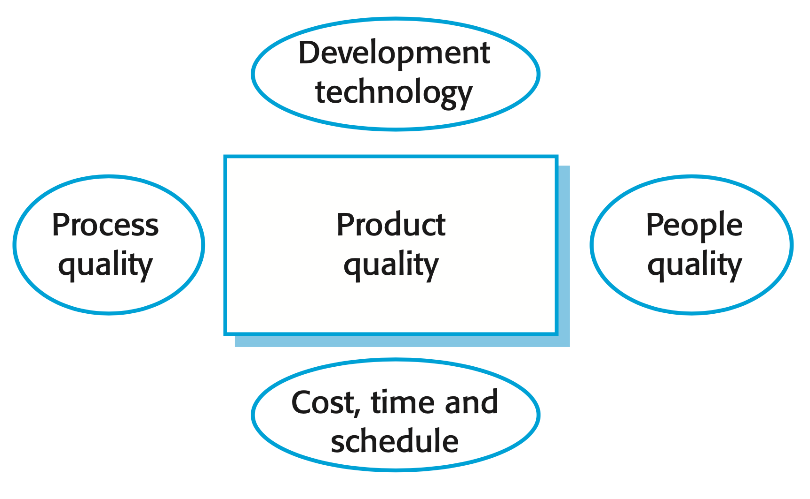
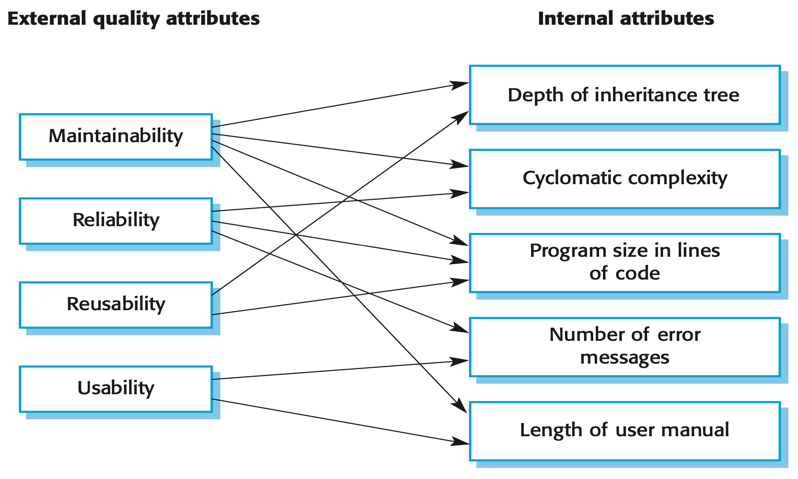

## Software Quality

*The focus may be ‘fitness for purpose’ rather than specification conformance.*

+ Quality, simplistically, means that a product should meet its specification. This is problematic for software systems
  + Conflicts exist between customer quality requirements (efficiency, reliability, etc.) and developer quality requirements (maintainability, reusability, etc.)
+ Some quality requirements are difficult to specify unambiguously
+ Software specifications are usually incomplete and often inconsistent.

## Software Fitness for Purpose

+ Have programming and documentation standards been followed in the development process?
+ Has the software been properly tested?
+ Is the software sufficiently dependable to be put into use?
+ Is the performance of the software acceptable for normal use? + Is the software usable?
+ Is the software well-structured and understandable?

## Software Quality Attributes

It is not possible for any system to be optimized for all of these attributes – for example, improving robustness may lead to loss of performance.

Common words used to describe such attributes are:

+ Safety
+ Understandability
+ Portability
+ Security
+ Learnability

## Software Quality Management

+ Concerned with ensuring that the required level of quality is achieved in a software product
+ Principal concerns
  + **Organizational level**
    + Establish a framework of organizational processes and standards that will lead to high- quality software
  + **Project level**
    + The application of specific quality processes and checking that these planned processes have been followed
    + Establish a quality plan for a project

## Software Quality Management

*The quality team should be independent from the development.*

+ Provides an independent check on the software development process
+ Checks the project deliverables to ensure that they are consistent with organizational standards and goals

## Quality Plans

*Quality plans should be short, succinct documents.*

+ State desired product qualities and how these are assessed
+ Identify the most significant quality attributes
+ Outline the quality assessment process
+ Recognize which organizational standards should be applied +Define new standards if necessary

## Scope of Quality Management

+ **Large, complex systems**
  + Quality documentation is a record of progress and supports continuity of development as the development team changes
+ **Smaller systems**
  + Needs less documentation and should focus on establishing a quality culture

## Process and Product Quality

{ width=50% }

+ Quality of a developed product is influenced by the quality of the production process.
+ A good process is usually required to produce a good product.
  + Important as some product quality attributes are hard to assess

## Software Standards

+ Define the required attributes of a product or process
+ **Product standards** define characteristics that all software components should exhibit e.g. a common programming style
+ **Process standards** define how the software process should be implemented

## Inspections

+ A group examines part or all of a process or system and its documentation to find potential problems.
+ There are different types of reviews with different objectives
  + Defect removal (product)
  + Progress assessment (product and process)
  + Quality reviews (product and standards)

## Software Measurement and Metrics

+ Concerned with deriving a numeric value for an attribute of a software product or process
  + Allows for objective comparisons between techniques and processes

## Software Metrics

+ Any type of measurement which relates to a software system, process or related documentation
+ Allow the software and the software process to be quantified
+ Used to predict product attributes or to control the software process
+ Product metrics can be used for general predictions or to identify anomalous components

## Product Metrics

+ A quality metric should be a predictor of product quality

Classes of product metrics

+ **Dynamic metrics**
  + Collected by measurements made of a program in execution
  + Closely related to software quality attributes
  + Help assess efficiency and reliability
+ **Static metrics**
  + Collected by measurements made of the system representations
  + Have an indirect relationship with quality attributes
  + Help assess complexity, understandability, and maintainability

## Relationships Between Internal and External Attributes

{ width=50% }

## Static Software Product Metrics

Software Metric | Description |
:- | :--------- |
Fan-in/Fan-out | Fan-in is a measure of the number of functions or methods that call another function or method (say X). Fan-out is the number of functions that are called by function X. A high value for fan-in means that X is tightly coupled to the rest of the design and changes to X will have extensive knock-on effects. A high value for fan-out suggests that the overall complexity of X may be high because of the complexity of the control logic needed to coordinate the called components. |
Length of code | This is a measure of the size of a program. Generally, the larger the size of the code of a component, the more complex and error-prone that component is likely to be. Length of code has been shown to be one of the most reliable metrics for predicting error-proneness in components. |
Cyclomatic complexity | This is a measure of the control complexity of a program. This control complexity may be related to program understandability. |
Length of identifiers | This is a measure of the average length of identifiers (names for variables, classes, methods, etc.) in a program. The longer the identifiers, the more likely they are to be meaningful and hence the more understandable the program. |
Depth of conditional nesting | This is a measure of the depth of nesting of if-statements in a program. Deeply nested if-statements are hard to understand and potentially error-prone. |
Fog index | This is a measure of the average length of words and sentences in documents. The higher the value of a document’s Fog index, the more difficult the document is to understand. |

## Problems with Measurement in Industry

+ Impossible to quantify the return on investment of introducing an organizational metrics program
+ No standards for software metrics or standardized processes for measurement and analysis
+ Software processes are not standardized and are poorly defined and controlled
+ Software measurement has focused on code-based metrics and plan-driven
development processes
  + Ill suited for software developed by configuring ERP systems or COTS
+ Introducing measurement adds additional overhead to processes

## Key Points

+ Software quality management is concerned with ensuring that software has a low number of defects and that it reaches the required standards of maintainability, reliability, portability etc.
+ Software standards are important for quality assurance as they represent an identification of ‘best practice’. When developing software, standards provide a solid foundation for building good quality software
+ Reviews of the software process deliverables involve a team of people who check that quality standards are being followed. Reviews are the most widely used technique for assessing quality
+ In a program inspection or peer review, a small team systematically checks the code. They read the code in detail and look for possible errors and omissions. The problems detected are discussed at a code review meeting
+ Agile quality management relies on establishing a quality culture where the development team works together to improve software quality
+ Software measurement can be used to gather quantitative data about software and the software process
+ You may be able to use the values of the software metrics that are collected to make inferences about product and process quality
+ Product quality metrics are particularly useful for highlighting anomalous components that may have quality problems. These components should then be analyzed in more detail
