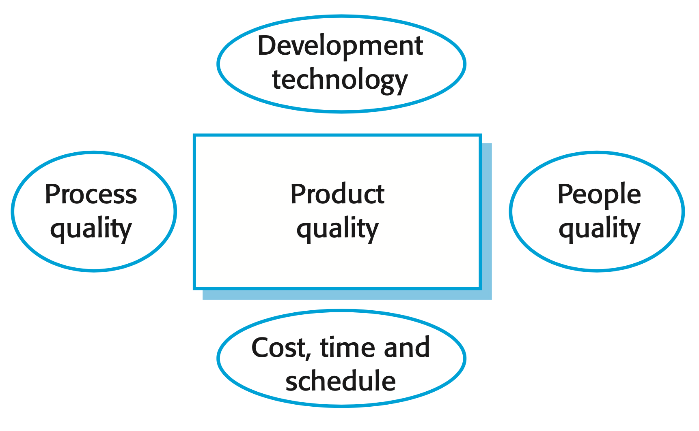
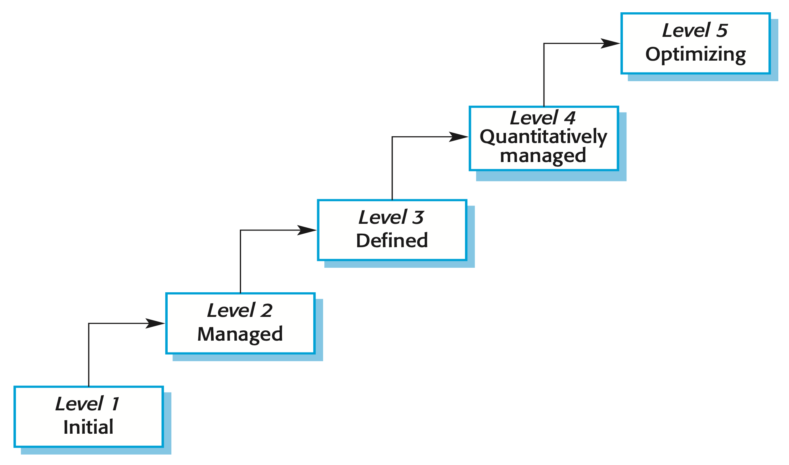

## Process Improvement

+ Many software companies have turned to software process improvement as a way of enhancing the quality of their software, reducing costs or accelerating their development processes
+ Process improvement means understanding existing processes and changing these processes to increase product quality and/or reduce costs and development time

## Approaches to Improvement

+ **Process maturity approach**
  + Focuses on improving process and project management and introducing good software engineering practice
+ **Agile approach**
  + Focuses on iterative development and the reduction of overheads in the software process

## Factors Affecting Software Product Quality

{ width=50% }

## Process Improvement

+ There is no such thing as an ‘ideal’ or ‘standard’ software process that is applicable in all organizations or for all software products of a particular type
+ Each company has to develop its own process depending on its size, the background and skills of its staff, the type of software being developed, customer and market requirements, and the company culture

## Improvement Attributes

+ Improve software quality by introducing new process activities that change the way software is developed and tested
+ Improve some attribute of the process itself (such as development time)

## Process Improvement Stages

+ **Process measurement**
  + Attributes of the current process are measured. These are baselines for assessing improvements
+ **Process analysis**
  + The current process is assessed and bottlenecks and weaknesses are identified
+ **Process change**
  + Changes to the process that have been identified during the analysis are introduced

## Process Measurement

+ Wherever possible, quantitative process data should be collected
  + Where organizations do not have clearly defined process standards, this is very difficult as you don’t know what to measure
  + A process may have to be defined before any measurement is possible
+ Process measurements should be used to assess process improvements
  + Does not mean that measurements should drive the improvements
  + The improvement driver should be the organizational objectives

## Process Metrics

+ Time taken for process activities to be completed
  + Example: Calendar time or effort to complete an activity or process
+ Resources required for processes or activities
  + Example: Total effort in person-days
+ Number of occurrences of a particular event
  + Example: Number of defects discovered

## Process Analysis

+ The study of existing processes to understand the relationships between parts of the process and to compare them with other processes
+ Process analysis and process measurement are intertwined
+ You need to carry out some analysis to know what to measure, and, when making measurements, you inevitably develop a deeper understanding of the process being measured

## Process Change

+ Involves making modifications to existing processes
+ This may involve:
  + Introducing new practices, methods or processes;
  + Changing the ordering of process activities;
  + Introducing or removing deliverables;
  + Introducing new roles or responsibilities
+ Change should be driven by measurable goals

## The CCMI Process Improvement Framework

+ The CMMI framework is the current stage of work on process assessment and improvement that started at the Software Engineering Institute in the 1980s
+ The SEI’s mission is to promote software technology transfer particularly to US defence contractors
+ It has had a profound influence on process improvement
  + Capability Maturity Model introduced in the early 1990s
  + Revised maturity framework (CMMI) introduced in 2001

## Process Capability Assessment

+ Intended as a means to assess the extent to which an organization’s processes follow best practice
+ By providing a means for assessment, it is possible to identify areas of weakness for process improvement
+ There have been various process assessment and improvement models but SEI’s work has been most influential

## The CMMI Model

+ An integrated capability model that includes software and systems engineering capability assessment
+ The model has two instantiations
  + **Staged** where the model is expressed in terms of maturity levels
  + **Continuous** where a capability rating is computed

## CMMI Model Components

+ Process areas
  + 22 process areas that are relevant to process capability and improvement are identified. These are organized into 4 groups
+ Goals
  + Goals are descriptions of desirable organizational states. Each process area has associated goals
+ Practices
  + Practices are ways of achieving a goal - however, they are advisory and other approaches to achieve the goal may be used

## CMMI Assessment

+ Examines the processes used in an organization and assesses their capability and maturity in each process area

Level | Continuos Representation Capability Levels | Staged Representation Maturity Levels |
:-: | :- | :- |
Level 0 | Incomplete | |
Level 1 | Performed | Initial |
Level 2 | Managed | Initial |
Level 3 | Defined | Defined |
Level 4 | | Quantitatively Managed |
Level 5 | | Optimizing |

## The Staged CMMI Model

+ Comparable with the software CMM
+ Each maturity level has process areas and goals. For example, the process area associated with the managed level include:
+ Requirements management
+ Project planning
+ Project monitoring and control
+ Supplier agreement management
+ Measurement and analysis
+ Process and product quality assurance

{ width=50% }

## The Continuous CMMI MOdel

+ This is a finer-grain model that considers individual or groups of practices and assesses their use
+ The maturity assessment is not a single value but is a set of values showing the organizations maturity in each area
+ Organizations can pick and choose process areas to improve according to their local needs

## Key Points

+ The CMMI process maturity model is an integrated process improvement model that supports both staged and continuous process improvement
+ Process improvement in the CMMI model is based on reaching a set of goals related to good software engineering practice and describing, standardizing and controlling the practices used to achieve these goals
+ The CMMI model includes recommended practices that may be used, but these are not obligatory
