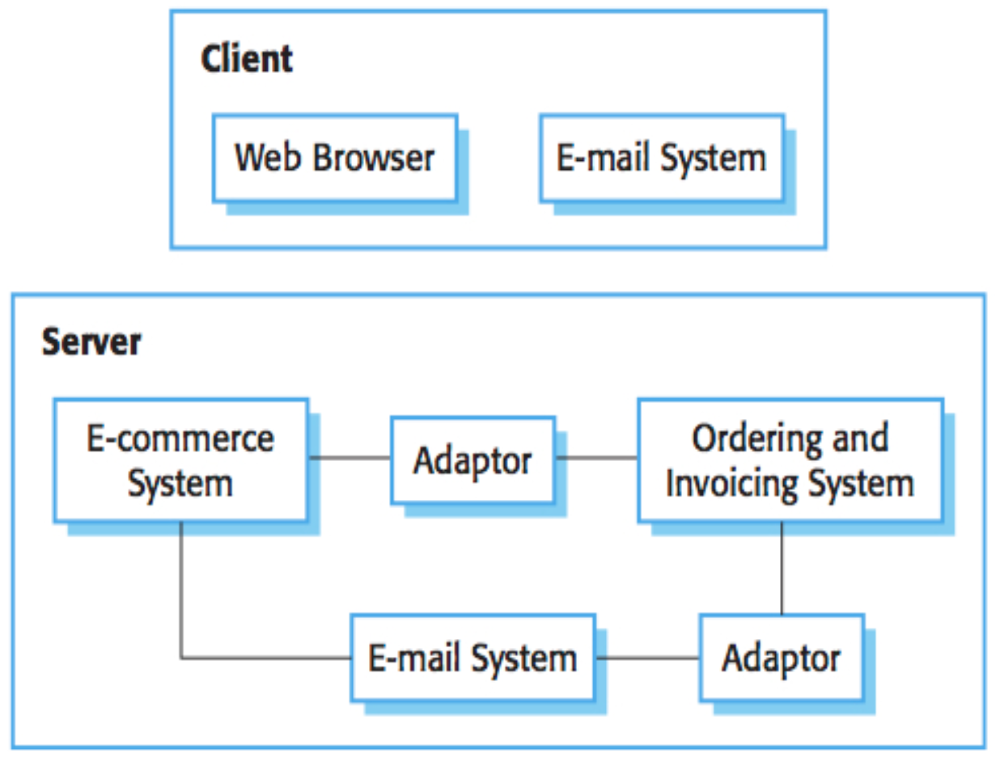

## Reuse Based Software Engineering

+ Application system reuse
  + The whole of an application system may be reused
+ Component reuse
  + Components of an application from sub-systems to single objects may be reused
+ Object and function reuse
  + Software components that implement a single well-defined object or function may be reused

## Benefits of Reuse

+ Increased dependability
+ Reduced process risk
+ Effective use of specialists (subject matter experts)
+ Standards compliance
+ Accelerated development

## Problems With Reuse

+ Increased maintenance costs
+ Lack of tool support
+ Not invented here syndrome
+ Finding, understanding, and adapting reusable components

## Factors Influencing Reuse

+ The development schedule for the software
+ The expected software lifetime
+ The background, skills and experience of the development team
+ The criticality of the software and its non-functional requirements
+ The application domain
+ The execution platform for the software

## Design Patterns

+ A design pattern is a way of reusing abstract knowledge about a problem and its solution
+ A pattern is a description of the problem and the essence of its solution
+ It should be sufficiently abstract to be reused in different settings
+ Pattern descriptions usually make use of object-oriented characteristics such as inheritance and polymorphism

## COTS Product Reuse

{ width=50% }

+ COTS - Commercial Off-The-Shelf systems.
+ Usually complete application systems that offer an API (Application Programming Interface)
+ Building large systems by integrating COTS systems is now a viable development strategy
for some types of system such as E-commerce systems
+ The key benefit is faster application development and, usually, lower development costs

## Software Product Lines

+ Applications with generic functionality that can be adapted and configured for use in a specific context
+ Applications with a common architecture and shared components, with each application specialized to reflect different requirements
+ Adaptation may involve:
  + Component and system configuration;
  + Adding new components to the system;
  + Selecting from a library of existing components;
  + Modifying components to meet new requirements

## Product Line Specialization

+ Platform specialization
  + Different versions of the application are developed for different platforms
+ Environment specialization
  + Different versions of the application are created to handle different operating environments e.g. different types of communication equipment
+ Functional specialization
  + Different versions of the application are created for customers with different requirements
+ Process specialization
  + Different versions of the application are created to support different business processes
