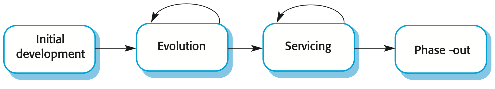

## Software Change

**Software change is inevitable.**

+ New requirements emerge when the software is in use
+ The business environment changes
+ Errors must be repaired
+ New computers and equipment are added to the system
+ The performance or reliability of the system may have to be improved
+ A key problem for all organizations is implementing and managing change to their existing software systems

## Importance of Evolution

+ Software systems are critical business assets
+ To maintain the value of these assets to the business, they must be changed and updated
+ The majority of the software budget in large companies is devoted to changing and evolving existing software rather than developing new software

## Evolution and Servicing

{ width=75% }

## The Software Evolution Process

{ width=100% }

## Urgent Change Requests

+ Urgent changes may have to be implemented without going through all stages of the software engineering process
  + A serious system fault has to be repaired to allow normal operation to continue
  + Changes to the system’s environment (e.g. an OS upgrade) have unexpected effects
  + Business changes that require a very rapid response (e.g. the release of a competing product)

## Software Maintenance

+ Modifying a program after it has been put into use
  + Does not normally involve major changes to the system’s architecture
  + Changes are implemented by modifying existing components and adding new components to the system
+ The term **“Maintenance”** is mostly used for changing custom software. Generic software products are said to evolve to create new versions

## Types of Maintenance

+ Repair software faults (Corrective)
  + Changing a system to correct deficiencies in the way meets its requirements
+ Adapt software to a different operating environment (Adaptive)
  + Changing a system so that it operates in a different environment (computer, OS, etc.) from its initial implementation
+ Add to or modify the system’s functionality (Perfective)
  + Modifying the system to satisfy new requirements
+ Refactoring (Preventive)
  + Modifying a program to improve its structure, reduce its complexity, or make it easier to understand

## Maintenance Costs

+ Usually greater than development costs (2* to 100* depending on the application)
+ Affected by both technical and non-technical factors
+ Increases as software is maintained. Maintenance corrupts the software structure so makes further maintenance more difficult
+ Ageing software can have high support costs (e.g. old languages, compilers etc.)

## Maintenance Cost Factors

+ Team stability
  + Maintenance costs are reduced if the same staff are involved with them for some time
+ Contractual responsibility
  + The developers of a system may have no contractual responsibility for maintenance so there is no
incentive to design for future change
+ Staff skills
  + Maintenance staff are often inexperienced and have limited domain knowledge
+ Program age and structure
  + As programs age, their structure is degraded and they become harder to understand and change
